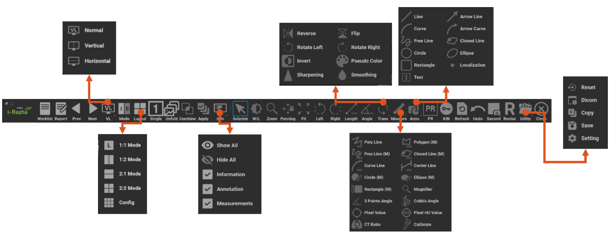

# Display Overview

:::info

I-Rapha View™는 DICOM 형태의 영상을 표시하고 진단 및 판독에 필요한 여러가지 의료영상 조작 기능을 제공하고 있습니다.
I-Rapha View™의 화면은 메뉴바, 토글버튼, 시리즈썸네일창, 영상표시창으로 구성되어 있습니다.

:::

- ⓵ 메뉴바 :의료영상을 조회, 판독하기 위해 필요한 기능을 나열하여 보여줍니다.
- ⓶ 시리즈: 썸네일창 현재 표시되는 스터디의 시리즈를 썸네일로 나열하여 보여줍니다.
- ⓷ 스터디탭: 뷰어에 열려 있는 스터디의 정보를 보여줍니다.
- ⓸ 의료영상표시창: 의료영상을 보여주는 화면입니다.

I-Rapha View™ 상단에 위치한 메뉴바(menubar)는 의료 영상을 조회, 판독하기 위한 여러가지 기능(Overlay, Transformations, Filtering 등)을 메타포와 툴팁을 포함하여 나타냅니다.
메뉴바에 표시되는 메뉴의 항목은 뷰어의 모드에 따라 변경됩니다.

## 메뉴

1. Maximize: I-Rapha View™를 화면 크기에 맞게 최대화합니다.
2. Viewer Info: I-Rapha View™의 버전 및 제조사의 연락처가 기재된 팝업이 표시됩니다.
3. Worklist: 워크리스트로 이동합니다.
4. Report: 리포트창을 실행합니다.
5. Prev Study Worklist: 상에서 현재 Study의 전에 있는 Study를 엽니다. 
6. Next Study Worklist:상에서 현재 Study의 다음에 있는 Study를 엽니다.
7. Virtual Layout: 뷰어의 가상 레이아웃을 변경합니다.
8. Mode: 영상을 표시하는 모드를 변경합니다.
9. Layout: 각 영상을 표시하는 배열의 행과 열의 수를 지정합니다.
10. Single View: 현재 선택된 영상만을 뷰어 전체화면으로 보여줍니다.
11. Unfold: 멀티프레임 영상의 경우, 각 프레임을 펼쳐서 모든 영상을 표시합니다.
12. Combine Series: 모든 시리즈를 하나로 병합할 수 있습니다. 시리즈 썸네일을 더블클릭해도 됩니다.
13. Apply All: 이미지 처리 적용범위를 나타내는 것으로 On일 경우 시리즈 내 모든 의료 영상에 적용됩니다.
14. Info: 영상 위에 스터디정보, 주석 정보, 측정정보의 표시되는 여부를 선택할 수 있습니다.
15. Select: 마우스 상태를 기본상태인 선택 기능으로 변경합니다.
16. W/L: 윈도우 레벨을 변경합니다.
17. Zoom: 영상을 확대/축소합니다.
18. Pan: 영상의 위치를 움직입니다.
19. Fit: 영상을 영상표시칸의 크기에 맞게 되돌립니다.
20. Left: 영상을 왼쪽으로 90 도 회전합니다.
21. Right: 영상을 오른쪽으로 90 도 회전합니다.
22. Length: 원하는 부위의 길이를 측정합니다.
23. Angle: 원하는 부위의 각도를 측정합니다.
24. Transformations: Rotation, Reverse, Sharpening 등 영상조작 기능을 포함합니다.
25. Measurements: Center Line, Pixel Value 등 영상측정 기능을 포함합니다.
26. Annotations: Arrow Line, Localization, Text 등 정보표시 기능을 포함합니다.
27. Presentation State: 영상의 주석, 측정정보, 디스플레이 상태를 저장하고 영상에 다시 적용할 수 있습니다.
28. Key Image Note: Key Image를 선택하는 모드를 실행합니다. 복수 선택한 이미지들이 Key Image Note로 저장됩니다.
29. Refresh: 로딩된 영상을 다시 로딩합니다.
30. Undo: 가장 최근에 추가된 주석(Annotation)이나 측정(Measurement)을 취소합니다.
31. Capture: 영역별로 Secondary Capture 영상을 생성합니다.
32. Revise: 영상을 수정하거나 마킹을 추가하고 저장합니다.
33. Utility: Reset, Dicom info, Copy, Setting 기능을 포함합니다.
34. Close: 뷰어창을 닫습니다.

## 메뉴(Menu)와 하위메뉴(Sub Menu)

I-Rapha View™의 메뉴바 내에 영상의 조회, 조작에 필요한 다양한 기능을 가진 메뉴가 있으며, [영상표시창]의 모드(Mode)에 따라 메뉴바의 구성이 달라집니다.
메뉴바의 메뉴중에 아이콘 하단에 역삼각형표시( )가 있는 메뉴는 하위메뉴를 가진 메뉴입니다.

## Layout 

[Layout] 메뉴를 선택하면 하위메뉴(sub menu)가 나타납니다. 하위메뉴의 구성은 다음과 같습니다.

- 1:1 Mode 영상표시칸을 1 행 × 1 열으로 설정
- 1:2 Mode 영상표시칸을 1 행 × 2 열으로 설정
- 2:1 Mode 영상표시칸을 2 행 × 1 열으로 설정
- 2:2 Mode 영상표시칸을 2 행 × 2 열으로 설정
- Config 영상표시칸을 최대 5 행 × 5 열까지 사용자가 설정

## Combine(시리즈 병합)

영상표시창에 표시되는 영상의 레이아웃을 설정합니다.

이미지 모드(Image Mode)에서만 나타나는 메뉴로 스터디 내의 여러 시리즈의 영상을 하나의 시리즈처럼 묶어서 영상을 표시합니다.
선택상태일 경우 스터디 내의 모든 시리즈 내의 영상을 하나의 시리즈처럼 묶어서 표시됩니다.

## Apply All(시리즈 내 모든 영상 적용)

이미지 모드(Image Mode)에서만 나타나는 메뉴로 현재 영상에 이루어지는 작업이 시리즈 내의 모든 영상에 적용되는지를 설정합니다.
선택상태일 경우 시리즈 내의 모든 영상에 작업의 결과가 반영됩니다. 미선택 상태일 경우 작업이 이루어지는 영상에만 작업결과가 반영됩니다.

## Navi(Navigation)
스택모드(Stack Mode)에서만 나타나는 메뉴로 네비게이션(Navigation)의 약어이며 영상의 위치의 정보를 표시하거나 찾아줍니다.
[Navi] 하위메뉴에는 Scout Line, Cross Link. Interstudy Cross Link 메뉴가 있습니다.

- Scout Line: 선택상자가 체크되어 있을 경우, 선택된 시리즈의 영상과 촬영각도가 다른 시리즈의 영상에 선택된 시리즈영상의 위치를 표시하는 Scout Line을 표시합니다.
- Cross Link: 선택된 시리즈의 영상에 원하는 부위에 마우스  릭하여 드래그 하면 다른 시리즈의 영상에서 선택된 시리즈의 영상의 위치를 찾아서 좌표선을 표시합니다.
- Inter Study: Inter Study Cross Link로 다른 스터디간에 Cross Link 기능을 실행합니다.

### Scout Line

1. 영상을 클릭하거나 클릭후 마우스 휠로 영상을 이동하여 기준 영상을 지정합니다.
2. 서로 다른 시리즈의 영상에서 기준 영상에 해당하는 위치표시선(Scout Line)을 표시해서 보여줍니다.

### Cross Link(크로스링크)

크로스링크(Cross Link) 기능은 기준영상의 원하는 부위에 마우스 클릭 또는 드래그 하면 서로 다른 시리즈의 영상에 해당하는 위치를 찾아서 좌표선을 이용하여 표시를 해줍니다. 스택모드(Stack Mode)에서만 작동하는 기능입니다.
1. 스택모드(Stack Mode)에서 메뉴바의 [Navi] 메뉴를 클릭합니다.
2. 스택모드(Stack Mode)에서 메뉴바의 [Navi] 메뉴를 클릭합니다.
3. 크로스링크(Cross Link) 기능이 활성화된 상태에서 하나의 시리즈 영상의 원하는 위치에 마우스를 클릭하거나 드래그하면 나머지 시리즈의 영상에 크로스 좌표선이 나타면서 원하는 위치가 표시됩니다.

## Cine(동영상)

멀티프레임을 가지고 있는 시리즈의 영상들을 동영상처럼 보여주기 위해 사용합니다.
선택한 시리즈가 멀티프레임을 가지고 있는 경우에는 Cine 기능이 자동으로 표시되며, 토글 메뉴를 이용해서 가릴 수 있습니다.

## Select

[영상표시창]에서 영상을 선택할 때 사용합니다.
이미지모드(Image Mode)에서 여러 개의 영상을 선택할 때에는 Ctrl 키를 누른 상태에서 마우스로 클릭하면 여러 개의 영상을 선택할 수 있습니다.(MacOS 의 경우 Command 키)
[영상표시창]에서 영상을 선택한 후 드래그를 이용해서도 여러개의 영상을 선택할 수 있습니다.

## W/L(영상 밝기/대조도 조정)

[영상표시창]의 영상의 Window Width 값과 Level 값을 조정하여 보기 위한 메뉴입니다.
[W/L] 메뉴가 선택된 상태에서 마우스를 상하좌우로 드래그하여 W/L 을 조절할 수 있습니다.
Window Width 는 대조도(Contrast)를, Window Level 은 밝기(Bright)를 의미합니다.

## Zoom(영상 확대/축소)

[영상표시창]에 표시된 영상을 확대 또는 축소하여 표시하는 메뉴입니다.
영상을 확대하여 표시하려면 Zoom 기능이 선택된 상태에서 원하는 영상 위에서 마우스를 위로 드래그 합니다.

## Pan(영상 위치 이동)

영상 표시창에 표시된 영상의 위치를 이동하여 표시하는데 사용합니다.

## Fit(영상 크기 및 위치 맞춤)

영상의 크기 또는 위치를 영상표시칸에 맞추는 기능을 제공합니다.
영상이 처음 영상표시칸에 표시된 상태보다 확대·축소되거나 위치가 이동되어 표시되어 있는 경우 해당 영상의 크기 또는 위치가 영상표시칸에 맞도록 조정하여 표시합니다.

## Left / Right (영상 회전)

[Left]기능은 Transformations 메뉴에서 설명할 [Rotate Left]와 같은 기능을 수행합니다.
[Right]기능은 Transformations 메뉴에서 설명할 [Rotate Right]와 같은 기능을 수행합니다.

## Length(길이 측정)

영상의 원하는 부위의 길이를 직선을 이용하여 측정합니다. 디폴드 측정 단위는 px입니다.

## Angle(각도측정)

특정 부위에 2 개의 선을 표시하고 그 선들이 이루고 있는 각도를 측정합니다.
측정된 각도는 @내각(외각)의 형식으로 표시됩니다.

## Transformations(영상변형도구)

영상에 변형을 가하여 영상조회에 도움을 주는 기능들이 모여 있습니다.
선택시 나타나는 하위메뉴의 구성은 다음과 같습니다.

- Reverse: 표시된 영상을 좌우로 뒤집습니다.
- Flip: 표시된 영상을 상하로 뒤집습니다.
- Rotation Left: 표시된 영상을 왼쪽(시계방향)으로 회전합니다.
- Rotation Right: 표시된 영상을 오른쪽(반시계방향)으로 회전합니다.
- Invert: 표시된 영상의 명암을 반전합니다.
- Sharpening: 표시된 영상에 Sharpening Fileter를 적용합니다.
- Smoothing: 표시된 영상에 Smoothiing Fileter를 적용합니다.
- Pseudo Color: 표시된 영상에 Pseudo Color 필터를 적용할 수 있는 메뉴를 띄웁니다.

## Measurements(측정도구)

영상의 측정과 관련된 기능들이 모여 있습니다

선택시 나타나는 하위메뉴의 구성은 다음과 같습니다.

- Poly Line: 폴리라인(꺾임선)을 이용하여 길이를 측정합니다. 폴리라인의 총 길이가 표시됩니다.
- Polygon: 직선으로 이루어진 다각형 영역의 둘레 길이, 영역 내부의 픽셀 최소값/최대값, 픽셀 평균값, 픽셀값의 표준편차를 측정합니다.
- Free Line: 프리라인(자유곡선)을 이용하여 전체길이를 측정합니다.
- Closed Line: 폐곡선 영역의 둘레 길이, 영역 내부의 픽셀 최소값/최대값, 픽셀 평균값, 픽셀값 표준편차를 측정합니다.
- Curve Line: 직선을 한쪽으로 휘게 하여 대칭곡선을 만들고 곡선의 전체 길이를 측정합니다.
- Center Line: 두 개의 직선을 이용하여 각 선의 길이와 각 선의 중심점을 연결한 각도를 측정합니다. 골격등의 부위별 두께와 각도를 측정할 수 있습니다.
- Circle (M): 원을 이용하여 넓이를 측정합니다. 원의 내부의 넓이가 표시됩니다.
- Ellipse (M): 타원 영역의 내부 넓이를 측정하고 표시합니다.
- Rectangle (M): 사각형을 이용하여 넓이를 측정합니다. 사각형 내부의 넓이가 표시됩니다.
- Magnifier: 영상의 일부분을 확대하여 표시합니다.
- 3 Points Angle: 지정한 3 개의 점이 이루는 각도를 표시합니다.
- Cobb’s Angle: Cobb 앵글을 측정합니다. 척추의 만곡도(굽은정도)를 측정할 때 사용합니다.
- Pixel Value: 지정된 Piexel의 2 차원 또는 3 차원 좌표상의 위치값과 컬러값 (CT의 경우 하운스필드값)을 표시합니다.
- Pixel HU Value: 마우스로 클릭한 위치의 픽셀 값을 저장합니다.
- CT Ratio: CT Ratio(Cardiothoracic Ratio, 심흉비)를 측정합니다.
- Calibrate: 픽셀의 길이정보(mm)가 없거나 부정확한 경우, 단위길이를 다시 지정하여 전체 측정값을 재계산합니다.

## Annotations(주석도구)

영상의 주석을 입력하는 기능들이 모여 있습니다.
선택시 하위메뉴의 구성은 다음과 같습니다.

## Capture 

영상이나 뷰어의 특정 영역을 캡쳐하여 DICOM 이미지로 생성합니다.

## Revise 

영상에 마킹을 추가하거나 영상을 편집하여 다시 저장할 수 있는 Revise 창을 띄웁니다.

## Utility(유틸리티)

뷰어의 기타 유용한 기능들을 모아놓은 메뉴입니다.

- Reset: 사용자가 추가한 Annotation 이나 Measurement 를 없애고 영상의 상태를 처음 상태로 되돌립니다.
- DICOM: 선택된 영상의 DICOM 헤더정보(DICOM Information)를 확인할 수 있습니다.
- Copy: 선택된 영상을 클립보드에 저장합니다. 클립보드 기능을 제공하는 다른 프로그램에서 클립보드 내용을 불러옴으로써 영상을 붙여넣을 수 있습니다.
- Save: 사용자가 추가한 Annotation 이나 Measurement 를 수동으로 저장합니다. 뷰어를 닫았다가 다시 열어도 이전에 그린 Annotation 이나 Measurement 이 유지됩니다.
- Setting: I-Rapha View™의 환경을 설정할 수 있는 팝업을 띄웁니다. 해당 페이지의 하위메뉴는 PACS 제품에 따라 다를 수 있습니다. 각 제품의 메뉴얼을 참고하십시오

:::info

DICOM 이란 의료용 디지털 영상 및 통신(Digital Imaging and Communications in Medicine, DICOM)의 약자로 의료용 기기에서 디지털 영상표현과 통신에 사용되는 표준을 총칭하는 말입니다. DICOM 에 대한 자세한 사항은 http://dicom.nema.org 를 참고하시기 바랍니다.

:::

## Unfold Multiframe

초음파 영상과 같은 멀티프레임 형식의 영상을 별도의 팝업창에서 개별 영상으로 펼쳐볼 수 있는 기능입니다.

멀티프레임 영상을 선택하고 메뉴바의 Unfold 버튼을 클릭하면 개별 영상으로 펼쳐진 팝업창이 생성됩니다. 특정위치 및 주변 프레임 영상을 Unfold 팝업창에서 곧바로 보고 싶다면 Cine 플레이어 컨트롤바를 이용하여 원하는 프레임 영상이 화면에 보이도록 조정한 후 Unfold 메뉴 버튼을 클릭합니다. 팝업창에 선택된 프레임이 위치한 페이지가 출력되고 선택한 프레임이 선택 표시된 상태로 디스플레이 됩니다.

팝업창에서 프레임 디스플레이 레이아웃 변경이 가능합니다. ( 1x1 ~ 5x5 )
마우스 휠 버튼 및 스크롤바를 이용하여 개별영상을 탐색할 수 있습니다. 마우스 휠 버튼을 이용하여 레이아웃 라인 단위로 스크롤 할 수 있으며 스크롤바의 상/하 버튼을 클릭하면 레이아웃 페이지 단위로 스크롤됩니다. 영상 수가 많아 스크롤이 번거로운 경우 스크롤바 영역을 마우스 왼쪽 버튼으로 클릭하여 클릭지점에 해당하는 페이지로 이동할 수 있습니다.

## 팝업

[영상표시창]에서 마우스의 오른쪽 버튼을 클릭을 하면 나타나는 메뉴로 I-Rapha View™의 메뉴바의 기능을 선택할 수 있습니다.

## Worklist

데이터조회 화면으로 이동합니다. 

## Report

조회하고 있는 스터디에 대한 판독소견서를 작성하고 조회하는 기능을 제공합니다.

## VL(Virtual Layout) 

뷰어에 표시되는 스터디의 레이아웃을 설정하는 메뉴입니다. 뷰어에 표시할 스터디의 개수를 최대 2 개까지 설정할 수 있습니다.

## Presentation State

영상의 주석, 측정정보, 디스플레이 상태를 저장하고 영상에 다시 적용할 수 있습니다.

