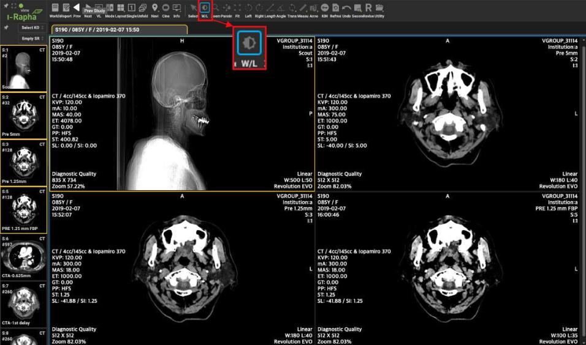
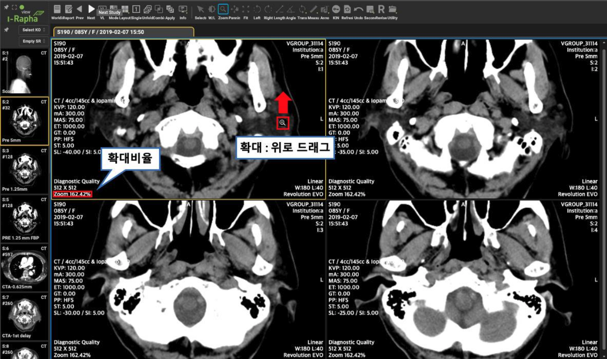
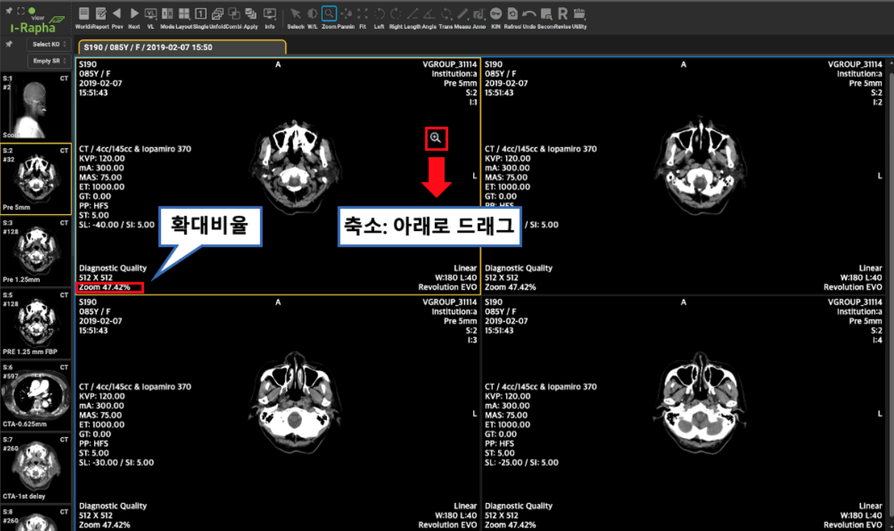
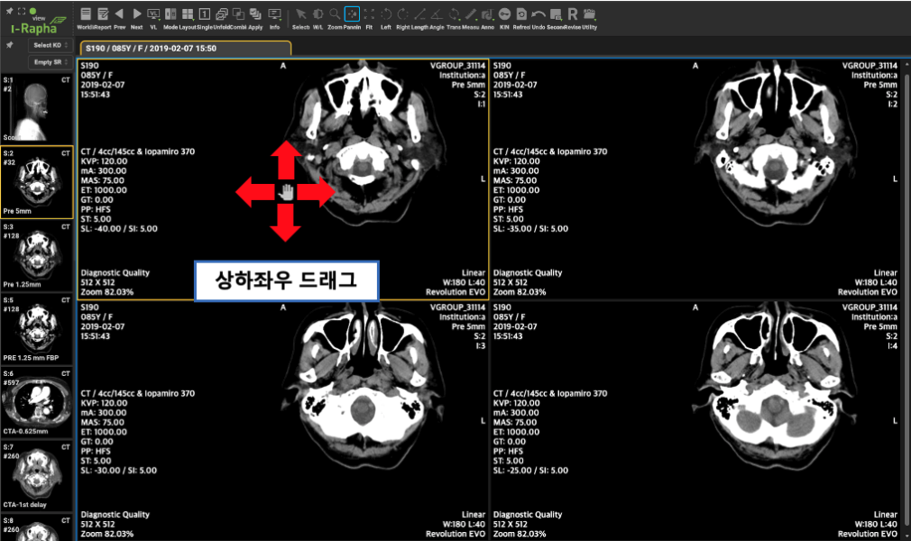
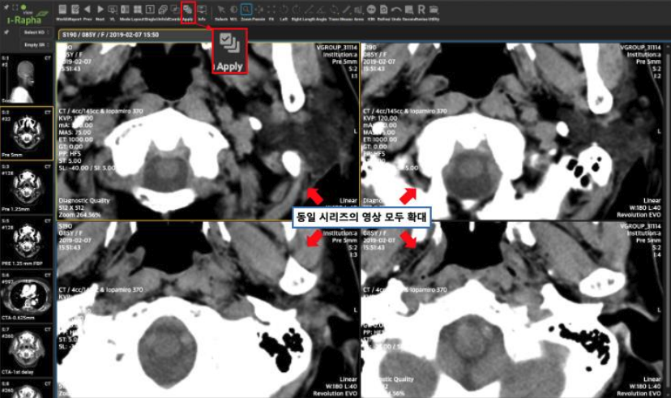
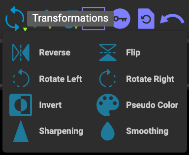
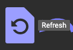

# Image Orientation and Manipulation

## 의료 영상 조작 

I-Rapha View™는 영상의 확대 및 밝기, 대조도의 조정, 특정부위의 길이나 각도의 측정과 같이 다양한 영상조작 및 측정기능을 제공하고 있습니다.

## Adjusting Window/Level (Brightness & Contrast)

**Window W/L(영상 밝기/대조도) 조정**

Window Width 는 대조도(Contrast)를, Window Level 은 밝기(Bright)를 의미합니다.
마우스 커서를 영상에 위치시키고 마우스를 상하, 좌우로 우클릭 드래그하면 영상의 Window Width 와 Level 이 변경됩니다. 
마우스의 좌우 드래그는 Window Width(대조도)를 변경하고 상하드래그는 Window Level(밝기)을 변경합니다.

Window Width 의 값이 클수록 넓은 범위의 Window Level(밝기)을 표현할 수 있으나 대조도(Contrast)가 낮아 지게 됩니다. 반대로 Window Width 의 값이 작으면 표현할 수 있는 Window Level(밝기)의 범위가 좁아지만 대조도(Contrast)가 높은 영상을 얻을 수 있습니다.

## Zooming, Panning

### Zoom(영상 확대/축소)

[영상표시창]에 표시된 영상을 확대 또는 축소하여 표시합니다. 영상을 선택한 후 마우스 오른쪽 버튼을 클릭하면 컨텍스트 메뉴가 표시됩니다. 축소( - ) 아이콘 또는 확대( + ) 아이콘을 클릭하여 정해진 비율 단계로 영상 크기를 조정할 수 있습니다. 설정 가능한 범위는 25% ~ 500% 이며 25~200 구간은 25% 단계, 200 ~ 500 구간은 50% 단계로 확대/축소됩니다. 세밀한 크기 조정 이 필요한 경우 텍스트 입력란을 통해 원하는 비율을 입력하고 키보드에서 Enter 키를 눌러주면 입력된 비율로 영상 크기가 조정됩니다. 입력 가능한 범위는 25 ~ 500 사이의 값으로 지정된 단계 없이 자유롭게 입력 가능합니다.

영상을 확대하여 표시하려면 Zoom 기능이 선택된 상태에서 원하는 영상 위에서 마우스를 위로 드래그 합니다.

영상을 축소하여 표시하려면 영상을 선택한 후 마우스를 아래로 드래그 하면 영상이 축소되어 표시됩니다.

:::info
Zoom 기능은 커서 위치와 관계없이 항상 화면의 중앙을 기준으로 확대/축소됩니다. 따라서 특정 상황에서 더 높은 위치 정확도를 제공합니다.
뷰의 기본 모드가 "최적 크기로 조정"으로 설정되어 있기 때문에, 다음 이미지를 스크롤할 때 이미지가 중앙에 위치하게 됩니다. 스크롤 시 이미지를 중앙에서 벗어나게 하려면 모드나 확대 배율을 변경해야 합니다.
:::

### Pan
영상 표시창에 표시된 영상의 위치를 이동하여 표시하는데 사용하는 기능입니다.

### Rotate

**Rotate Left: 영상 왼쪽으로 돌리기**
1. 메뉴바에서 [Trans.] 메뉴의 하위메뉴에서 [Rotate Left] 메뉴를 마우스로 선택합니다.
2. 선택된 영상이 속한 시리즈의 모든 영상들이 왼쪽(반시계방향)으로 회전되어서 표시가 됩니다. 이미지모드(Image Mode)에서는 [영상표시창]에 보이는 영상의 시리즈에 적용됩니다. 스택모드(Stack Mode)에서는 선택한 영상의 시리즈에 적용됩니다. Rotate Left 는 메뉴바의 Left 툴팁으로도 적용가능합니다.

**Rotate Right: 영상 오른쪽으로 돌리기**
메뉴바에서 [Trans.] 메뉴의 하위메뉴에서 [Rotate Right] 메뉴를 마우스로 선택합니다.
Rotate Right 는 메뉴바의 Right 툴팁으로도 적용가능합니다.

## Fit

영상이 Zoom 기능으로 확대·축소되거나 Pan 기능으로 이동표시되어 있을 때 영상표시칸에 영상이 처음 표시된 상태로 조정하여 되돌리는 기능입니다. 

## Apply All(시리즈 내 모든 영상 적용)

이미지 모드(Image Mode)에서만 나타나는 메뉴로 현재 영상에 이루어지는 작업이 시리즈 내의 모든 영상에 적용되는지를 설정합니다.
선택상태일 경우 시리즈 내의 모든 영상에 작업의 결과가 반영됩니다. 미선택 상태일 경우 작업이 이루어지는 영상에만 작업결과가 반영됩니다.

이미지모드(Image Mode)가 선택되었을 때 나타나는 메뉴이며 [Apply All] 상태가 ON일 경우 시리즈 내의 모든 영상에 영상 조작 기능(Zoom, Window Width/Level 조정 등)을 동시에 적용됩니다. OFF 상태일 경우에는 선택된 영상에만 영상 조작 기능이 적용되며, 시리즈 내의 다른 영상에는 영향을 미치지 않습니다. 만일 동일한 영상 조작 기능을 시리즈 내의 다른 영상에 적용하기 위해서는 동일한 작업을 반복해야 합니다.

토글 방식으로 작동하며, [Combine] 메뉴를 클릭하면 현재 적용된 상태에서 다른 상태로 변경이 됩니다. 기본 상태는 ON 입니다.

Apply All 메뉴가 적용되는 영상 조작 기능은 다음과 같습니다.

* W/L
* Zoom
* Pan
* Fit 
* Trans > Reverse / Flip / Rotate Left / Rotate Right / Invert / Sharpening / Smoothing
* Pseudo Color
* Reset
* Undo

[Apply All] 메뉴가 ON 상태에서 Zoom 기능으로 하나의 영상을 확대할 경우 동일 시리즈 내의 모든 영상이 함께 확대됩니다.

 
[Apply All] 메뉴가 OFF 상태에서 Zoom 기능으로 하나의 영상을 확대한 경우 선택된 영상만 함께 확대됩니다.

## Transformations

Transformations(변형도구) 기능은 영상의 표시 방향이나 방법을 변경하여 영상조회를 더욱 효과적으로 영상조회를 할 수 있는 도구들을 제공합니다.

**Transformations 하위메뉴**

메뉴바에서 [Trans.] 메뉴를 마우스로 클릭합니다.

### Reverse: 영상 좌우 뒤집기
1. 메뉴바에서 [Trans.] 메뉴의 하위메뉴에서 [Reverse] 메뉴를 마우스로 선택합니다.

2. 선택된 영상이 속한 시리즈의 모든 영상들이 좌우가 뒤집어져서 표시가 됩니다. 이미지모드(Image Mode)에서는 [영상표시창]에 보이는 영상의 시리즈에 적용됩니다. 스택모드(Stack Mode)에서는 선택한 영상의 시리즈에 적용됩니다.

### Flip: 영상상하 뒤집기
1. 메뉴바에서 [Trans.] 메뉴의 하위메뉴에서 [Flip] 메뉴를 마우스로 선택합니다.

2. 선택된 영상이 속한 시리즈의 모든 영상들이 상하가 뒤집어져서 표시가 됩니다. 이미지모드(Image Mode)에서는 [영상표시창]에 보이는 영상의 시리즈에 적용됩니다. 스택모드(Stack Mode)에서는 선택한 영상의 시리즈에 적용됩니다.

### Invert: 영상 명암 반전하기
1. 메뉴바에서 [Trans.] 메뉴의 하위메뉴에서 [Invert] 메뉴를 마우스로 선택합니다.
2. 선택된 영상이 속한 시리즈의 모든 영상들의 명암이 반전이 되어 표시됩니다.

### Sharpening: 영상 선명하게 보기
선택된 영상에 Sharpening 처리를 하여 더욱 선명하게 보이게 합니다.

1. 메뉴바에서 [Trans.] 메뉴의 하위메뉴에서 [Sharpening] 메뉴를 마우스로 선택합니다.
2. 선택된 영상이 속한 시리즈의 모든 영상들의 픽셀이 더욱 선명하게 표시가 됩니다. 이미지모드(Image Mode)에서는 [영상표시창]에 보이는 영상의 시리즈에 적용됩니다. 스택모드(Stack Mode)에서는 선택한 영상의 시리즈에 적용됩니다

###  Smoothing: 영상 부드럽게 보기
선택된 영상에 Smoothing 처리를 하여 부드럽게 보이게 합니다.
1. 메뉴바에서 [Trans.] 메뉴의 하위메뉴에서 [Smoothing] 메뉴를 마우스로 선택합니다.

2. 선택된 영상이 속한 시리즈의 모든 영상들의 픽셀을 부드럽게 표시가 됩니다.
이미지모드(Image Mode)에서는 [영상표시창]에 보이는 영상의 시리즈에 적용됩니다.
스택모드(Stack Mode)에서는 선택한 영상의 시리즈에 적용됩니다.

### Pseudo Color: 영상 색상 맵핑하기
Pseudo Color 는 흑백 영상의 각 픽셀에 대해 그 농도 레벨에 따라 색을 할당하여 색채화하는 기법입니다.
1. 메뉴바에서 [Trans.] 메뉴의 하위메뉴에서 [Pseudo Color] 메뉴를 마우스로 선택합니다.
2. Pseudo Color 팝업창의 리스트박스에서 선택한 Pseudo Color 방식에 따라 색상이 입혀져서 표시됩니다. 이미지모드(Image Mode)에서는 [영상표시창]에 보이는 영상의 시리즈에 적용됩니다. 스택모드(Stack Mode)에서는 선택한 영상의 시리즈에 적용됩니다.

## Refresh

영상이 뷰어에 로딩된 이후에 새로 추가된 영상을 보기 위해서 영상을 뷰어에서 다시 로딩합니다.

## Undo(실행취소)

영상에 마지막으로 삽입된 주석(Annotation)이나 측정(Measurement)을 취소하는 메뉴입니다.

## Left / Right (영상 회전)

메뉴바의 [Left]기능은 Transformations 메뉴에서 설명할 [Rotate Left]와 같은 기능을 수행합니다.
메뉴바의 [Right]기능은 Transformations 메뉴에서 설명할 [Rotate Right]와 같은 기능을 수행합니다.

## Display Information/Display Annotation/Display Measurent

[영상표시창]의 영상 위에 표시되는 정보, 주석, 측정정보의 표시여부를 설정하는 토글기능입니다.

## Presentation State

Presentation State 를 선택하여 영상에 적용하는 기능입니다. 저장된 Presentation State 가 없는 경우 목록에 Create GSPS 만 나타납니다. 저장된 목록이 있는 경우 목록에서 적용할 state 를 클릭하면 해당 state 에 체크 표시가 되고 선택한 state 가 적용된 상태로 영상이 업데이트 됩니다. 원본 영상으로 되돌리고 싶다면 목록에서 체크된 state 를 다시 클릭합니다. 체크가 해제되면서 영상은 원본 영상으로 업데이트 됩니다.

