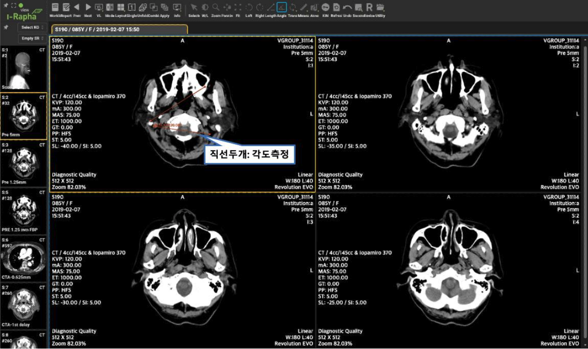

# Annotation and Measurement

## Annotation 
메뉴바의 [Annot.] 메뉴에는 영상의 주석을 입력하는 기능들이 모여 있습니다. [Annot.] 메뉴를 선택하면 하위메뉴가 나타납니다. 하위메뉴의 구성은 다음과 같습니다.

- Line: 영상 위에 직선 주석을 삽입합니다. 
- Arrow Line: 영상 위에 화살표 주석을 삽입합니다. 
- Curve: 영상 위에 곡선 주석을 삽입합니다. 
- Arrow Curve: 영상 위에 휘어진 화살표 주석을 삽입합니다. 
- Free Line: 영상 위에 자유선 주석을 삽입합니다. 
- Closed Line: 영상 위에 폐곡선 주석을 삽입합니다. 
- Circle: 영상 위에 원 주석을 삽입합니다. 
- Ellipse: 영상 위에 타원 주석을 그립니다. 
- Rectangle: 영상 위에 사각형 주석을 삽입합니다. 
- Magnifie: 영상의 일부분을 확대하여 표시합니다
- Localization: 영상 위에 위치표시점을 삽입합니다. 
- Text: 영상 위에 글자 주석을 삽입합니다.
- 3 Points Angle: 지정한 3 개의 점이 이루는 각도를 표시합니다.
- Cobb’s Angle: Cobb 앵글을 측정합니다. 척추의 만곡도(굽은정도)를 측정할 때 사용합니다.
- Pixel Value: 지정된 Piexel의 2 차원 또는 3 차원 좌표상의 위치값과 컬러값(CT의 경우 하운스필드값)을 표시합니다.
- Pixel HU Value: 마우스로 클릭한 위치의 픽셀 값을 저장합니다.
- CT Ratio: CT Ratio(Cardiothoracic Ratio, 심흉비)를 측정합니다.
- Calibrate: 픽셀의 길이정보(mm)가 없거나 부정확한 경우, 단위길이를 다시 지정하여 전체 측정값을 재계산합니다.

Undo(실행취소)
메뉴바의 [Undo] 메뉴는 영상에 마지막으로 삽입된 주석(Annotation)이나 측정(Measurement)을 취소하는 메뉴입니다.

### Line: 직선 주석
[Annot.] 메뉴의 Line 기능은 영상 위에 Line(직선) 주석을 그립니다.
1. 메뉴바에서 [Annot.] 메뉴의 하위메뉴에서 [Line] 하위메뉴를 마우스로 선택합니다 마우스 커서가 로 변경되면서 Line 주석 기능을 사용할 수 있게 됩니다.
Line 주석을 그리기 위해서는 영상의 원하는 부분에 마우스를 클릭하여 시작점을 지정한 후 마우스를 원하는 곳까지 드래그 후 마우스 클릭을 해제하면 Line 이 그려집니다.
2. 마우스 커서가 로 변경되면서 Line 주석 기능을 사용할 수 있게 됩니다.
3. Line 주석을 그리기 위해서는 영상의 원하는 부분에 마우스를 클릭하여 시작점을 지정한 후 마우스를 원하는 곳까지 드래그 후 마우스 클릭을 해제하면 Line 이 그려집니다.
4. Line 주석 입력상태에서 ESC 키를 누르면 주석입력이 완료되면서 Select 상태로 변경됩니다.
5. 주석은 삽입이 완료되는 순간 자동으로 저장됩니다. 

주석의 수정, 이동, 삭제는 『Length(직선 길이측정)기능』의 내용을 참조하시기 바랍니다.

### Arrow Line: 화살표 주석
[Annot.] 메뉴의 [Arrow Line] 기능은 마우스를 이용하여 영상 위에 자유롭게 화살표(Arrow) 주석을 그립니다.
1. 메뉴바에서 [Annot.] 메뉴의 하위메뉴에서 [Arrow Line] 하위메뉴를 마우스로 선택합니다.
2. 마우스 커서가 로 변경되면서 Arrow Line 주석 기능을 사용할 수 있게 됩니다.
3. Arrow Line 주석을 그리기 위해서는 영상의 원하는 부분에 마우스를 클릭하여 시작점을 지정한 후 마우스를 원하는 곳까지 드래그 후 마우스 클릭을 해제하면 Arrow Line 이 그려집니다. 마우스 클릭을 해제한 지점이 화살표의 머리가 됩니다.
4. Arrow Line 주석 입력상태에서 ESC 키를 누르면 주석입력이 완료되면서 Select 상태로 변경됩니다.
5. 주석은 삽입이 완료되는 순간 자동으로 저장됩니다. 주석의 수정, 이동, 삭제는 본 장의 『Length(직선 길이측정)기능』의 내용을 참조하시기 바랍니다.

### Curve: 곡선 주석
[Annot.] 메뉴의 [Curve] 기능은 마우스를 이용하여 영상 위에 자유롭게 곡선(Curve) 주석을 표기합니다.
1. 메뉴바에서 [Annot.] 메뉴의 하위메뉴에서 [Curve] 하위메뉴를 마우스로 선택합니다.
2. 마우스 커서로 변경되면서 Curve 주석 기능을 사용할 수 있게 됩니다.
3. 영상의 원하는 부분에 마우스를 클릭하여 시작점을 지정한 후 마우스를 원하는 곳까지 드래그 후 마우스 클릭을 해제하면 직선이 그려집니다.
4. 직선에서 극점이 될 지점에 마우스를 드래그하여 곡선으로 변형시킵니다.
5. Curve 주석 입력상태에서 ESC 키를 누르면 주석입력이 완료되면서 Select 상태로 변경됩니다.
6. 주석은 삽입이 완료되는 순간 자동으로 저장됩니다.
주석의 수정, 이동, 삭제는 본 장의 『Length(직선 길이측정)기능』의 내용을 참조하시기 바랍니다.

### Arrow Curve: 곡선 화살표 주석
[Annot.] 메뉴의 [Arrow Curve] 기능은 마우스를 이용하여 영상 위에 자유롭게 곡선 화살표(Arrow Curve) 주석을 그립니다.

1. 메뉴바에서 [Annot.] 메뉴의 하위메뉴에서 [Arrow Curve] 하위메뉴를 마우스로 선택합니다.
2. 마우스 커서가 로 변경되면서 Arrow Curve 주석 기능을 사용할 수 있게 됩니다.
3. 영상의 원하는 부분에 마우스를 클릭하여 시작점을 지정한 후 마우스를 원하는 곳까지 드래그 후 마우스 클릭을 해제하면 직선 화살표가 그려집니다.
4. 직선에서 극점이 될 지점에 마우스를 드래그하여 곡선으로 변형시킵니다. 직선에서 극점이 될 지점에 마우스를 드래그하면 곡선으로 변형되며, ⓷에서 마우스 클릭을 해제한 지점이 화살표의 머리가 됩니다.
5. Curve 주석 입력상태에서 ESC 키를 누르면 주석입력이 완료되면서 Select 상태로 변경됩니다.
6. 주석은 삽입이 완료되는 순간 자동으로 저장됩니다.

주석의 수정, 이동, 삭제는 본 장의 『Length(직선 길이측정)기능』의 내용을 참조하시기 바랍니다

## Measurements

영상의 측정과 관련된 기능들이 모여 있습니다.

선택시 나타나는 하위메뉴의 구성은 다음과 같습니다.

- Poly Line: 폴리라인(꺾인 선)을 이용하여 길이를 측정합니다. 폴리라인의 총 길이가 표시됩니다.
- Polygon: 직선으로 이루어진 다각형 영역의 둘레 길이, 영역 내부의 픽셀 최소값/최대값, 픽셀 평균값, 픽셀값의 표준편차를 측정합니다.
- Free Line: 프리라인(자유곡선)을 이용하여 전체길이를 측정합니다.
- Closed Line: 폐곡선 영역의 둘레 길이, 영역 내부의 픽셀 최소값/최대값, 픽셀 평균값, 픽셀값 표준편차를 측정합니다.
- Curve Line: 직선을 한쪽으로 휘게 하여 대칭곡선을 만들고 곡선의 전체 길이를 측정합니다.
- Center Line: 두 개의 직선을 이용하여 각 선의 길이와 각 선의 중심점을 연결한 각도를 측정합니다. 골격등의 부위별 두께와 각도를 측정할 수 있습니다.
- Circle (M): 원을 이용하여 넓이를 측정합니다. 원의 내부의 넓이가 표시됩니다.
- Ellipse (M): 타원 영역의 내부 넓이를 측정하고 표시합니다.
- Rectangle (M): 사각형을 이용하여 넓이를 측정합니다. 사각형 내부의 넓이가 표시됩니다.
- Magnifier: 영상의 일부분을 확대하여 표시합니다.
- 3 Points Angle: 지정한 3 개의 점이 이루는 각도를 표시합니다.
- Cobb’s Angle: Cobb 앵글을 측정합니다. 척추의 만곡도(굽은 정도)를 측정할 때 사용합니다.
- Pixel Value: 지정된 Piexel의 2 차원 또는 3 차원 좌표상의 위치값과 컬러값 (CT의 경우 하운스필드값)을 표시합니다.
- Pixel HU Value: 마우스로 클릭한 위치의 픽셀 값을 저장합니다.
- CT Ratio: CT Ratio(Cardiothoracic Ratio, 심흉비)를 측정합니다.
- Calibrate: 픽셀의 길이정보(mm)가 없거나 부정확한 경우, 단위길이를 다시 지정하여 전체 측정값을 재계산합니다.

### Length(길이 측정)

영상의 원하는 부위에 마우스로 시작점과 끝점을 선택하면 이 시작점과 끝점을 잇는 측정선이 표시되고, 그 직선의 길이를 측정하는 기능입니다. 

**직선길이 측정하기**

1. 메뉴바에서 [Length] 메뉴를 마우스로 선택합니다.
2. 마우스 커서가 측정커서 변경되면서 Length 기능을 사용할 수 있게 됩니다.
3. 측정을 원하는 부위에서 마우스를 눌러 시작점을 지정한 후 마우스를 드래그해 끝점에서 마우스를 올립니다.
4. 시작점과 끝점을 잇는 직선이 표시되고 그 직선의 길이를 측정한 값이 표시됩니다.
5. 측정된 내용은 각 측정이 완료되는 시점에 자동으로 저장됩니다.

**Length 측정선 이동하기**
Length(직선 길이측정)기능의 측정선을 이동하기 위해서는 다음의 절차를 따릅니다.
이 절차는 Length 기능뿐만 아니라 다른 Measurement 기능과 Annotation 기능에도 동일하게 적용됩니다.
1. 측정한 Length 측정선 위로 Selctor 상태의 마우스 커서를 이동하여 클릭하면 측정선이 선택되면서 노란색으로 변합니다.
2. 마우스를 클릭하여 측정선이 선택된 상태에서 마우스로 이동하여 원하는 위치로 이동시킵니다. 이동시킨 부위에서 측정값이 표시됩니다.
3. 수정된 내용은 수정이 완료되는 시점에 자동으로 저장됩니다.

**Length 측정선 수정하기**
Length(직선 길이측정)기능의 측정선을 수정하기 위해서는 다음의 절차를 따릅니다.
이 절차는 Length 기능뿐만 아니라 다른 Measurement 기능과 Annotation 기능에도 동일하게 적용됩니다.
1. 측정선 끝점을 마우스로 클릭하면 마우스커서의 상태가 이동커서로 변경됩니다.
2. 이동커서상태에서 측정점을 클릭하여 이동합니다. 이동된 측정점에 따라 측정선이 수정되면서 새로운 측정값이 표시됩니다.
3. 수정된 내용은 수정이 완료되는 시점에 자동으로 저장됩니다. 측정선 수정은 Length 팝업메뉴의 Modify 기능으로도 가능합니다. 

**Length 측정값 삭제하기**
Length(직선 길이측정)기능의 측정값을 삭제하기 위해서는 다음의 절차를 따릅니다.
이 절차는 Length 기능뿐만 아니라 다른 측정(Measurement) 기능과 주석(Annotation)기능에도 동일하게 적용됩니다.

1. 측정선을 마우스 커서로 클릭하면 직선이 선택되면서 노란색으로 변합니다.
2. 측정선이 선택된 상태에서 마우스 우측버튼을 클릭하면 팝업메뉴가 나타납니다. 팝업메뉴에서 Delete 항목을 선택합니다.
3. 선택된 측정선과 길이측정값이 삭제됩니다. 측정선 삭제는 측정선 선택 후, backspace 키로도 삭제 가능합니다.
4. 삭제된 내용은 자동으로 저장됩니다.

**Length 측정 중단하기: Pause**

Length(직선 길이측정)기능을 멈추려면 ESC 키를 누르거나 다음의 절차를 따릅니다.

### Angle(각도측정)

특정 부위에 2 개의 선을 표시하고 그 선들이 이루고 있는 각도를 측정합니다. 측정된 각도는 `@내각(외각)`의 형식으로 표시됩니다.

**각도 측정하기**

1. 메뉴바에서 [Angle] 메뉴를 마우스로 선택합니다.
2. 마우스 커서가 측정커서가 변경되면서 Angle 기능을 사용할 수 있게 됩니다.
3. 측정을 원하는 부위에서 마우스를 눌러 시작점을 지정한 후 마우스를 드래그해 끝점에서 마우스를 올려 첫번째 측정선을 지정합니다.
4. 두 번째 측정선을 같은 방법으로 지정하면 첫번째 측정선과 이루는 각도가 자동으로 표시됩니다. 측정된 각도는 `@내각(외각)` 형식으로 표시됩니다.
5. 측정된 내용은 측정이 완료되는 시점에 자동으로 저장됩니다.

**Center Line**

1. 골격등 특정 부위의 폭을 측정할 수 있는 직선을 그립니다.
2. 다른 부위의 폭을 측정할 수 있는 직선을 그립니다.
3. 두 직선의 길이와 함께 두 직선의 중심점간의 거리와 각도를 측정합니다.

**Cobb’s Angle**

1. 1 번, 2 번 두 점을 클릭하여 상단에 가장 기울어진 척추골을 찾아 평행선을 그립니다.
2. 3 번, 4 번 두 점을 클릭하여 하단에 가장 기울어진 척추골을 찾아 평행선을 그립니다.
3. 척추측만증 여부를 판단합니다.

**CT Ratio(Cardiothoracic Ratio, 심흉비)**

1. 1 번, 2 번 두 점을 클릭하여 척추와 나란한 기준 축을 그립니다
2. 3 번, 4 번 두 점을 클릭하여 좌심방, 우심방 각각의 끝 점을 연결한 선을 그립니다
3. 5 번, 6 번 두 점을 클릭하여 폐(Thoracic)의 가장 끝 점을 연결한 선을 그립니다.
4. 심흉비 결과를 확인합니다

#### Poly Line: 폴리라인으로 길이 측정
[Measurements] 메뉴의 Poly Line 기능은 폴리라인(여러 개의 선이 연결된 선) 측정선을 이용하여 길이를 측정하는 기능입니다.
1. 메뉴바에서 [Measurements] 메뉴의 하위메뉴에서 [Poly Line] 메뉴를 마우스로 선택합니다.
2. 마우스 커서가 측정커서 로 변경되면서 Poly Line 측정기능을 사용할 수 있게 됩니다.
3. 측정을 원하는 부위에 마우스를 클릭하여 측정시작점을 지정합니다. 이후에는 원하는 위치 어느곳이나 마우스로 클릭하여 측정점을 여러개를 지정할 수 있습니다. 각 측정점들은 직선으로 연결됩니다.
4. 각 측정점들은 직선으로 연결되며 각 측정점마다 시작점에서부터의 총 길이를 측정한 값이 표시됩니다.
5. Poly Line 측정 상태에서 마우스를 더블클릭하거나 ESC 키를 누르면 측정이 완료되면서 Select 상태로 변경됩니다.
6. 측정된 내용은 측정이 완료되는 순간 자동으로 저장됩니다.

Poly Line 의 수정, 이동, 삭제는 본 장의 『Length(직선 길이 측정)』(#length길이-측정)의 내용을 참조하시기 바랍니다.

#### Polygon (M): 다각형 영역 측정
[Measurements] 메뉴의 Polygon 기능은 마우스를 이용하여 다각형을 그리면 영역의 둘레 길이, 영역 내부의 픽셀 최소값/최대값, 픽셀 평균값, 픽셀값의 표준편차를 측정하는 기능입니다.
1. 메뉴바에서 [Measurements] 메뉴의 하위메뉴에서 [Polygon] 메뉴를 마우스로 선택합니다.
2. 마우스 커서가 측정커서 로 변경되면서 Polygon 측정기능을 사용할 수 있게 됩니다.
3. 측정을 원하는 부위를 마우스를 클릭하여 이동하면서 다각형 영역을 그립니다.
4. 세 번째 클릭부터 마우스를 클릭할 때마다 첫 번째 클릭 지점으로 연결선이 표시되면서 그려질 영역을 확인할 수 있습니다. 측정할 영역을 확정하고 싶으면 더블클릭하여 영역 그리기를 종료합니다.
5. 영역에 대한 측정값이 첫 번째 클릭지점에 표시됩니다.

#### Free Line (M): 자유선으로 길이 측정
[Measurements] 메뉴의 Free Line 기능은 마우스를 이용하여 자유롭게 측정선을 그린 후 길이를 측정하는 기능입니다.
1. 메뉴바에서 [Measurements] 메뉴의 하위메뉴에서 [Free Line] 메뉴를 마우스로 선택합니다
2. 마우스 커서가 측정커서로 변경되면서 Free Line 측정기능을 사용할 수 있게 됩니다.
3. 측정을 원하는 부위를 마우스를 클릭하여 이동하여 측정선을 그립니다.
4. 측정선의 길이를 측정한 값이 마지막 측정점에 표시됩니다.
5. Free Line 측정 상태에서 ESC 키를 누르면 측정이 완료되면서 Select 상태로 변경됩니다.
6. 측정된 내용은 측정이 완료되는 순간 자동으로 저장됩니다.
Free Line 의 수정, 이동, 삭제는 본 장의 『Length(직선 길이측정)』의 내용을 참조하시기 바랍니다

### Closed Line (M): 폐곡선 영역 측정
[Measurements] 메뉴의 Closed Line (M) 기능은 마우스를 이용하여 폐곡선을 그리면 영역의 둘레
길이, 영역 내부의 픽셀 최소값/최대값, 픽셀 평균값, 픽셀값의 표준편차를 측정하는 기능입니다.
1. 메뉴바에서 [Measurements] 메뉴의 하위메뉴에서 [Closed Line (M)] 메뉴를 마우스로 선택합니다.
2. 마우스 커서가 측정커서 로 변경되면서 Closed Line (M) 측정기능을 사용할 수 있게 됩니다.
3. 측정을 원하는 부위를 마우스를 클릭한 상태로 드래그하여 영역을 그립니다.
4. 측정할 영역을 확정하고 싶으면 마우스 클릭을 해제합니다. 마우스 클릭 해제한 지점과 첫 번째 클릭한 지점이 자동으로 선으로 연결되면서 영역이 완성됩니다.
5. 영역 내부의 측정값이 첫 번째 클릭지점에 표시됩니다.

#### Center Line: 직선의 중심점간 거리, 각도 측정
[Measurements] 메뉴의 Center Line 기능은 두 개의 직선을 이용하여 각 선의 길이와 각 선의 중심점을 연결한 각도를 측정하는 기능입니다.
1. 메뉴바에서 [Measurements] 메뉴의 하위메뉴에서 [Rectangle] 메뉴를 클릭합니다.
2. 마우스 커서가 측정커서 로 변경되면서 Center Line 측정기능을 사용할 수 있게 됩니다.
3. 측정을 원하는 부위를 마우스를 이용하여 측정선 두 개를 그립니다. 각 측정선을 그릴 때 마다 측정길이가 표시됩니다.
4. 두 번째 측정선을 그리면, 두 측정선의 중심을 잇는 직선이 생성되며 측정된 거리와 각도가 자동으로 표시됩니다. 측정된 각도는 “@내각(외각)”형식으로 표시됩니다
5. Center Line 측정 상태에서 ESC 키를 누르면 측정이 완료되면서 Select 상태로 변경됩니다.
6. 측정된 내용은 측정이 완료되는 순간 자동으로 저장됩니다.

Center Line 길이, 각도 측정의 수정, 이동, 삭제는 본 장의 『Length(직선 길이측정)』의 내용을 참조하시기 바랍니다.

#### Curve Line: 곡선의 길이 측정
Curve Line 기능은 마우스를 이용하여 곡선을 그린 후 그려진 곡선의 길이를 기능입니다.
1. 메뉴바에서 [Measurements] 메뉴의 하위메뉴에서 [Curve Line] 메뉴를 마우스로 클릭합니다.
2. 마우스 커서가 측정커서 로 변경되면서 Curve Line 측정기능을 사용할 수 있게 됩니다.
3. 측정을 원하는 부위를 마우스를 이용하여 직선을 그립니다.
4. 직선에서 극점이 될 지점에 마우스를 드래그하여 곡선으로 변형시킵니다.
5. 곡선의 길이를 계산한 값이 표시됩니다.
6. Curve Line 측정 상태에서 ESC 키를 누르면 측정이 완료되면서 Select 상태로 변경됩니다.
7. 측정된 내용은 측정이 완료되는 순간 자동으로 저장됩니다. Curve Line 길이 측정의 수정, 이동, 삭제는 본 장의 『Length(직선 길이측정)』의 내용을 참조하시기 바랍니다.

#### Circle (M): 원의 넓이 측정
Circle (M) 기능은 마우스를 이용하여 그린 원의 넓이를 측정하는 기능입니다.
1. 메뉴바에서 [Measurements] 메뉴의 하위메뉴에서 [Circle (M)] 메뉴를 클릭합니다.
2. 마우스 커서가 측정커서 로 변경되면서 Circle (M) 측정기능을 사용할 수 있게 됩니다.
3. 측정을 원하는 부위를 마우스를 이용하여 원을 그립니다.
4. 원의 넓이, 영역 내부의 픽셀 최소값/최대값, 픽셀 평균값, 픽셀값의 표준편차를 계산한 값이 표시됩니다.
5. Circle Area 넓이 측정 상태에서 ESC 키를 누르면 측정이 완료되면서 Select 상태로 변경됩니다.

Circle Area 넓이 측정의 수정, 이동, 삭제는 본 장의 『Length(직선 길이측정)』의 내용을 참조하시기 바랍니다.

#### Ellipse (M): 타원형의 넓이 측정

Ellipse (M)는 마우스를 이용하여 그린 타원형의 넓이를 측정하는 기능입니다.
1. 메뉴바에서 [Measurements] 메뉴의 하위메뉴에서 [Ellipse (M)] 메뉴를 클릭합니다.
2. 마우스 커서가 측정커서로 변경되면서 Ellipse 측정기능을 사용할 수 있게 됩니다.
3. 측정을 원하는 부위를 마우스를 이용하여 타원을 그립니다.
4. 타원의 컨트롤 포인트를 드래그하면 크기가 변경됩니다.
5. 타원의 넓이를 계산한 값이 표시됩니다.
6. 측정된 내용은 측정이 완료되는 순간 자동으로 저장됩니다.

#### Rectangle (M): 사각형 영역 측정

Rectangle(M)은 마우스를 이용하여 사각형을 그린 후 그려진 사각형의 영역의 둘레 길이, 영역 내부의 픽셀 최소값/최대값, 픽셀 평균값, 픽셀값의 표준편차를 측정하는 기능입니다.
1. 메뉴바에서 [Measurements] 메뉴의 하위메뉴에서 [Rectangle (M)] 메뉴를 마우스로 선택합니다.
2. 마우스 커서가 측정커서 로 변경되면서 Rectangle 측정기능을 사용할 수 있게 됩니다.
3. 측정을 원하는 부위를 마우스를 이용하여 사각형을 그립니다.
4. 측정사각형의 둘레 길이, 측정사각형의 넓이, 영역 내부의 픽셀 최소값/최대값, 픽셀 평균값, 픽셀값의 표준편차를 계산한 값이 표시됩니다.
5. Rectangle 넓이 측정 상태에서 ESC 키를 누르면 Select 상태로 변경됩니다.
6. 측정된 내용은 측정이 완료되는 순간 자동으로 저장됩니다.

Rectangle 넓이 측정의 수정, 이동, 삭제는 본 장의 『Length(직선 길이측정)』의 내용을 참조하시기 바랍니다.

#### 3 Points Angle: 각도측정(3 점 방식)
[Measurements] 메뉴의 3 Points Angle 기능은 3 개의 점을 지정하여 각도를 측정하는 기능입니다.
1. 메뉴바에서 [Measurements] 메뉴의 하위메뉴에서 [3 Points Angle] 메뉴를 마우스로 선택합니다.
2. 마우스 커서가 측정커서 로 변경되면서 3 Points Angle 측정기능을 사용할 수 있게 됩니다.
3. 다음 그림의 번호 순서에 따라 측정점 3 개를 마우스 클릭하여 선택합니다.
4. 지정된 3 개의 측정점이 이루는 각도가 2 번 측정점 옆에 나타납니다. `@내각(외각)` 의 형식으로 표시됩니다.
5. 3 Points Angle 측정 상태에서 ESC 키를 누르면 측정이 완료되면서 Select 상태로 변경됩니다.
6. 측정된 내용은 측정이 완료되는 순간 자동으로 저장됩니다.
7. Points Angle 측정의 수정, 이동, 삭제는 본 장의 『Length(직선 길이측정)』의 내용을 참조하시기 바랍니다.

### Cobb’s Angle: 콥스앵글 측정
[Measurements] 메뉴의 Cobb’s Angle 기능은 일반 X-ray 영상(Plain X-ray Image)에서 척추측만증(Scollosis)등의 경우처럼 척추가 휘어진 경우 그 휘어진 정도를 측정하는 데 가장 많이 사용되는 방법 콥스각도를 측정하는 기능입니다.
1. 메뉴바에서 [Measurements] 메뉴의 하위메뉴에서 [Cobb’s Angle] 메뉴를 마우스로 선택합니다.
2. 마우스 커서가 측정커서 로 변경되면서 Cobb’s Angle 측정기능을 사용할 수 있게 됩니다.
3. 측정을 원하는 부위에 측정점을 두 개 찍어서 첫 번째 측정선을 표시합니다.
4. 두 번째 측정선을 표시하면 첫 번째 측정선과 이루는 각도가 표시됩니다. `@내각(외각)` 의 형식으로 각도가 표시됩니다.
5. Cobb’s Angle 측정 상태에서 ESC 키를 누르면 측정이 완료되면서 Select 상태로 변경됩니다.
6. 측정된 내용은 측정이 완료되는 순간 자동으로 저장됩니다.

CT Ratio: 심흉비(Cardiothoracic Ratio) 측정
[Measerments] 메뉴의 CT Ratio 기능은 심장비대 여부 판단에 도움이 되는 심장의 넓이와 흉곽의 넓이의 비인 심흉비(CT Ratio)를 측정하는 기능입니다.
1. 메뉴바에서 [Measerments] 메뉴의 하위메뉴에서 [CT Ratio] 메뉴를 마우스로 선택합니다.
2. 마우스 커서가 측정커서 로 변경되면서 CT Ratio 측정기능을 사용할 수 있게 됩니다.
3. 다음 그림의 번호 순서에 따라 기준선(1 번 선)을 척추를 따라 표시하고 기준선을 양측으로 심장의 크기를 측정하는 심장크기 측정선(2 번 선과 3 번 선)을 표시합니다. 마지막으로 흉곽 크기측정선(4 번 선)을 표시합니다.
4. 측정결과로 심장의 크기(C), 흉곽의 크기(T), 심흉비(C/T)가 표시됩니다. 흉심비의 단위는 %(퍼센트)입니다.
5. CT Ratio 측정 상태에서 ESC 키를 누르면 측정이 완료되면서 Select 상태로 변경됩니다.
6. 측정된 내용은 측정이 완료되는 순간 자동으로 저장됩니다. 

#### Pixel Value: 픽셀값 보기
[Measurements] 메뉴의 Pixel Value 기능은 영상의 각 픽셀의 위치정보와 픽셀의 농도값(색상값)을 가집니다. 특히 CT 영상의 픽셀값은 CT 값(Housefield Unit Value)을 의미하며 조직에 따라 값을 가집니다. 각 조직별 CT 값은 다음과 같습니다.

| 조직   |       CT Number(Hounsefield Unit Value)      |  
|----------|:--------------------------:|
| Air |  -1000 | 
| Lung |    -500   | 
| Fat | -100~-50 |
| Water |   0 | 
| Kidney |    30   | 
| Blood | 30~45 |
| Muscle |  10~40 | 
| Grey matter |    37~45   | 
| White matter | 20~30 |
| Liver |  40~60 | 
| Soft Tissue, Contrast |    100~300   | 
| Bone |  700(cancellous bone)~3000(dense bone)   | 

메뉴바에서 [Measurements] 메뉴의 하위메뉴에서 [Pixe Value] 메뉴를 마우스로 선택합니다.
픽셀값을 측정하기 원하는 곳에 마우스를 클릭하면 영상의 하단에 해당 픽셀의 정보가 나타납니다. 표시되는 픽셀정보는 다음과 같습니다.

**Position: 픽셀의 위치정보**
- 3d Position: CT, MR과 같이 3 차원 좌표정보를 가진 영상의 경우 X, Y, Z 축 위치 정보가 표시됨
- 2d Position: CR, DX와 같이 2 차원 좌표정보를 가진 영상의 경우 X, Y 축 위치 정보가 표시됨
- Pixel Value: 픽셀의 농도값 또는 색상값을 특히함. 특히 CT 영상은 CT값(HU Value)를 나타냄

#### Magnifier: 돋보기로 보기
[Measurements] 메뉴의 Magnifier 기능은 영상을 전체를 확대해 보지 않고 원하는 부위만 돋보기로 확대해 보는 기능입니다.
1. 메뉴바에서 [Measurements] 메뉴의 하위메뉴에서 [Magnifier] 메뉴를 마우스로 선택합니다.
2. 마우스 커서가 돋보기커서 로 변경되면서 돋보기 기능을 사용할 수 있게 됩니다.
3. 원하는 부분을 확대하기위해 마우스를 클릭하거나 클릭후 이동하면 마우스가 위치한 부분이 돋보기로 확대되어 보입니다.
4. Magnifier 보기를 완료하려면 ESC 키보드를 누르면 됩니다.

#### Calibrate: 픽셀 길이 보정
[Measurements] 메뉴의 Calibrate 기능은 픽셀의 길이정보(mm)가 없거나 부정확한 경우, 단위길이를 다시 지정하여 전체 측정값을 재계산해서 보정된 길이를 확인할 수 있습니다. 기준이 되는 길이만큼 마우스를 드래그하고 마우를 클릭 해제하면 길이를 입력하는 팝업창이 나타납니다. 보정할 길이를 입력 후 확인을 누르면 영상 오른쪽과 하단에 있는 룰러의 길이 정보가 변경됩니다. 이미 측정해놓은 길이가 있었다면 보정한 길이를 기준으로 다시 계산되어 화면에 업데이트 됩니다. Calibrate 기능을 수행하더라도 보정이후 달라진 측정 값이나 길이 정보는 화면상으로만 업데이트 되고 영상에 저장되어 있는 값은 변경되지 않습니다.

## Reset (선택사항 초기화)

영상에 가해진 조작기능(W/L, Zoom, Pan)이나 측정기능(Length, Angle, Trans, Measurements, Annot.)을 모두 초기화하여 영상을 처음 상태로 리셋하는 기능입니다.

**Reset: 영상 처음상태로 리셋하기**
1. 영상조작 기능이나 측정기능이 적용된 영상에서 [Utility] 하위메뉴의 [Reset] 메뉴를 마우스로 클릭합니다.
2. 영상에 행해진 모든 작업이 초기화되면서 영상이 처음상태로 되돌아 갑니다. 마우스의 상태도 기본 상태인 Selector 상태가 됩니다.

