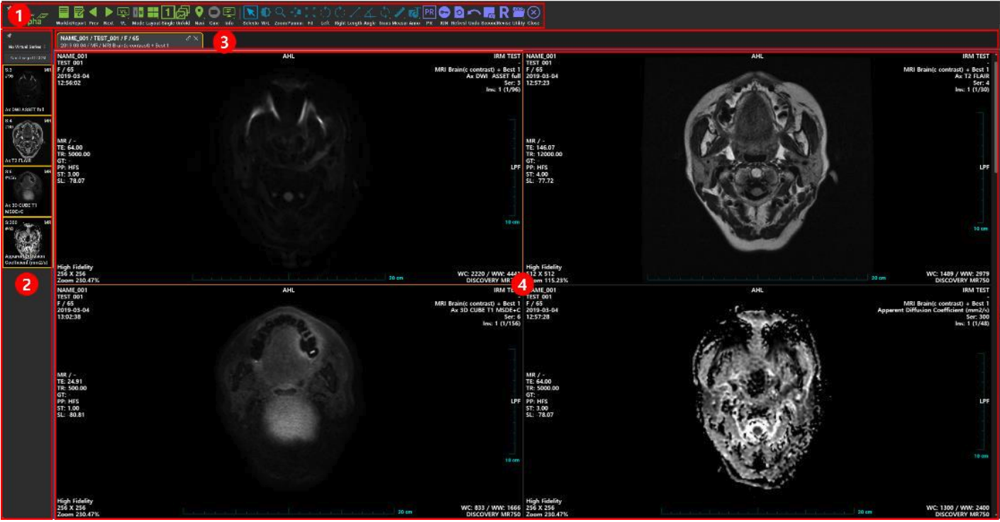
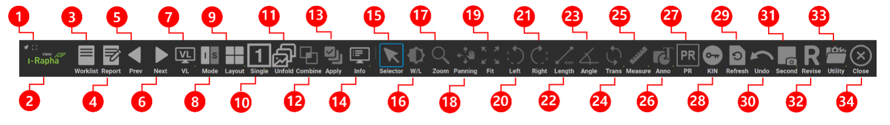
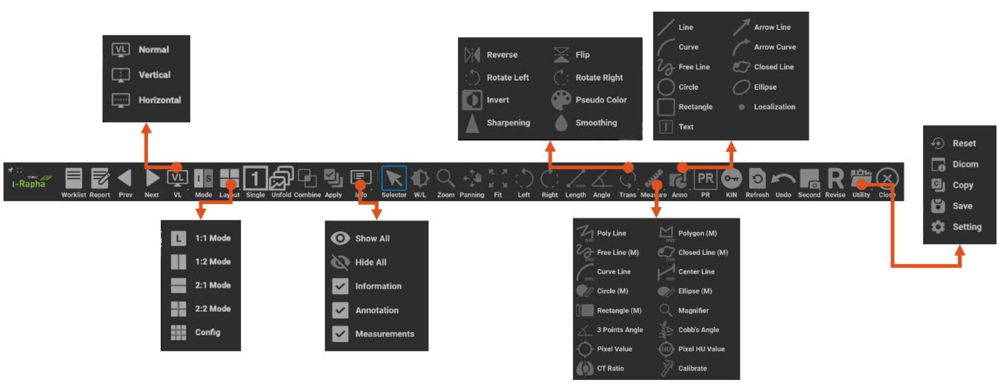

# Display Overview

:::info

I-Rapha View™ displays DICOM images and provides various image manipulation features necessary for medical diagnosis and interpretation. The I-Rapha View™ interface consists of a menu bar, toggle buttons, series thumbnail window, and image display window.

:::

- ⓵ Menu Bar: Lists functions needed to view and interpret medical images.
- ⓶ Series Thumbnails: Displays series from the current study as thumbnails.
- ⓷ Study Tab: Shows information for the studies opened in the viewer.
- ⓸ Image Display Window: Displays the medical images.

The menu bar at the top of I-Rapha View™ provides various functions (Overlay, Transformations, Filtering, etc.) for viewing and interpreting medical images, with icons and tooltips. The menu items shown vary depending on the viewer mode.

## Menu

1. Maximize: Maximizes I-Rapha View™ to fit the screen.
2. Viewer Info: Opens a pop-up with version and manufacturer contact details.
3. Worklist: Opens the worklist.
4. Report: Opens the report window.
5. Prev Study Worklist: Opens the study before the current one in the worklist.
6. Next Study Worklist: Opens the study after the current one in the worklist.
7. Virtual Layout: Changes the virtual layout of the viewer.
8. Mode: Changes the mode for displaying images.
9. Layout: Sets the rows and columns for image arrangement.
10. Single View: Displays only the currently selected image in fullscreen.
11. Unfold: For multi-frame images, displays all frames.
12. Combine Series: Merges all series into one (can also double-click on a series thumbnail).
13. Apply All: When on, applies image processing to all images in the series.
14. Info: Chooses to display study, annotation, and measurement info on the image.
15. Select: Changes mouse status to default selection.
16. W/L: Changes the window level.
17. Zoom: Zooms in/out on the image.
18. Pan: Moves the image position.
19. Fit: Resets the image to fit the display window.
20. Left: Rotates the image 90 degrees left.
21. Right: Rotates the image 90 degrees right.
22. Length: Measures the length of a selected part.
23. Angle: Measures the angle of a selected part.
24. Transformations: Includes functions like Rotate, Flip, and Sharpen.
25. Measurements: Includes Center Line, Pixel Value, etc., for image measurement.
26. Annotations: Adds arrows, localization, text, and other annotations.
27. Presentation State: Saves and re-applies annotation, measurement, and display state.
28. Key Image Note: Starts key image selection mode; multiple selected images are saved as key images.
29. Refresh: Reloads the loaded image.
30. Undo: Cancels the most recent annotation or measurement.
31. Capture: Creates a secondary capture image for each section.
32. Revise: Edits or adds markings to an image and saves changes.
33. Utility: Includes Reset, DICOM info, Copy, and Settings functions.
34. Close: Closes the viewer window

## Sub Menus

The menu bar in I-Rapha View™ offers various features needed for viewing and manipulating images. The options in the menu bar change based on the [Display Window] mode. Menus with a downward triangle icon have submenus.

## Layout 

Selecting the [Layout] menu displays a submenu with the following options:

- 1:1 Mode: Sets the display window to 1 row × 1 column.
- 1:2 Mode: Sets the display window to 1 row × 2 columns.
- 2:1 Mode: Sets the display window to 2 rows × 1 column.
- 2:2 Mode: Sets the display window to 2 rows × 2 columns.
- Config: Allows users to set the display window up to 5 rows × 5 columns.

## Combine(Series Merge)

This option is available only in Image Mode and merges multiple series within a study to display them as a single series in the display window. When selected, all images in the study are merged and shown as a single series.

## Apply All (Apply to All Images in Series)

Available only in Image Mode, this option applies the current operation to all images in the series. When selected, the changes are reflected across the entire series; if unselected, only the current image reflects the changes.

## Navi(Navigation)
This menu appears only in Stack Mode, providing location information for images. The submenu includes Scout Line, Cross Link, and Interstudy Cross Link options.

Scout Line: Shows the location of selected series images on images with different angles within the series.
Cross Link: Allows users to mark a location in one series and locate the corresponding position in other series, displaying a coordinate line.
Inter Study: Executes the Cross Link function across different studies.

### Scout Line

1. Click or scroll on an image to set a reference image.
2. Scout Lines show the corresponding location in other series images.

### Cross Link

Cross Link allows users to mark a location on a reference image by clicking or dragging, displaying the corresponding coordinates on other series images. It operates only in Stack Mode.

1. In Stack Mode, select the [Navi] menu.
2. Activate Cross Link and click or drag to mark a location on one series, displaying coordinates on other series images.

## Cine(Video)

This function displays images from multi-frame series like a video. If the selected series has multi-frames, Cine mode appears automatically and can be toggled on or off.

## Select

Used to select images in the [Display Window]. In Image Mode, hold down the Ctrl key (Command on MacOS) and click to select multiple images, or drag to select several images at once.

## W/L(Brightness/Contrast Adjustment)

Adjusts the Window Width and Level values in the [Display Window]. When [W/L] is selected, drag the mouse vertically and horizontally to adjust. Window Width controls contrast, and Window Level controls brightness.

## Zoom (in/out)

Zooms in or out on images in the [Display Window]. To zoom in, select Zoom and drag the mouse upward over the desired image.

## Pan(Image Position Adjustment)

Moves the position of the image in the display window.

## Fit (Adjust Image Size and Position)

This function adjusts the size or position of an image to fit the display area. If the image has been zoomed in or out, or moved from its original display position, this feature repositions and resizes it to fit the display window.

## Left / Right (Image Rotation)

[Left]: Performs the same function as [Rotate Left] under the Transformations menu.
[Right]: Performs the same function as [Rotate Right] under the Transformations menu.

## Length(Measure Length)

Measures the length of a selected area in the image using a straight line. The default unit is pixels (px).

## Angle(Measure Angle)

Displays two lines on a selected area and measures the angle between them. The measured angle is displayed in the format @inner angle (or outer angle).

## Transformations(Image Transformation Tools)

These tools help with viewing by allowing modifications to the image. The submenu options include:

- Reverse: Flips the displayed image horizontally.
- Flip: Flips the displayed image vertically.
- Rotation Left: Rotates the image left (clockwise).
- Rotation Right: Rotates the image right (counterclockwise).
- Invert: Inverts the brightness and contrast of the displayed image.
- Sharpening: Applies a sharpening filter to the displayed image.
- Smoothing: Applies a smoothing filter to the displayed image.
- Pseudo Color: Opens a menu to apply a pseudo color filter to the displayed image.

## Measurements

These tools are used for various image measurements. The submenu options include:

* Poly Line: Measures the total length using a polyline (broken line).
* Polygon: Measures the perimeter of a polygonal area and calculates minimum, maximum, average pixel values, and pixel value standard deviation within the area.
* Free Line: Measures the total length using a freehand curve.
* Closed Line: Measures the perimeter of a closed curve and calculates minimum, maximum, average pixel values, and standard deviation of pixel values within the area.
* Curve Line: Measures the length of a curved line created by bending a straight line symmetrically.
* Center Line: Measures the length of two lines and the angle between their central points; used for thickness and angle measurements, such as skeletal structures.
* Circle (M): Measures the area within a circle.
* Ellipse (M): Measures and displays the area within an ellipse.
* Rectangle (M): Measures the area within a rectangle.
* Magnifier: Enlarges a selected part of the image.
* 3 Points Angle: Displays the angle formed by three designated points.
* Cobb’s Angle: Measures Cobb’s angle, used for evaluating spinal curvature.
* Pixel Value: Shows the 2D or 3D coordinates and color value (Hounsfield unit for CT) of a specified pixel.
* Pixel HU Value: Saves the pixel value at the clicked position.
* CT Ratio: Measures the CT (Cardiothoracic) ratio.
* Calibrate: Recalculates measurements by resetting the unit length if pixel length information (mm) is missing or inaccurate.

## Annotations

These tools allow for inputting annotations on images. When selected, a submenu appears.

## Capture 

Captures a specific area of the image or viewer and generates a DICOM image.

## Revise 

Opens a Revise window for adding markings or editing the image, with options to save changes.

## Utility(유틸리티)

A menu with additional useful viewer features:

- Reset: Removes user-added Annotations and Measurements, resetting the image to its original state.
- DICOM: Displays DICOM header information for the selected image.
- Copy: Saves the selected image to the clipboard, allowing it to be pasted in other applications that support clipboard functions.
- Save: Manually saves user-added Annotations and Measurements, so they remain even if the viewer is closed and reopened.
- Setting: Opens a popup for configuring I-Rapha View™ settings. The submenu may vary depending on the PACS product. Refer to each product's manual for details.

:::info

What is DICOM?

DICOM stands for Digital Imaging and Communications in Medicine, a standard for handling, storing, and transmitting medical imaging information. For more details, visit http://dicom.nema.org.

:::

## Unfold Multiframe

This feature allows individual frames of a multiframe image, such as an ultrasound, to be viewed in a separate popup window.

After selecting a multiframe image, click the Unfold button in the menu bar to open a popup displaying each frame individually. To quickly view a specific frame and its surrounding frames, adjust the desired frame using the Cine player control bar, then click the Unfold button. The popup will display the page with the selected frame highlighted.

Frame display layout can be customized in the popup (from 1x1 to 5x5). Use the mouse wheel and scrollbar to navigate through frames. The wheel scrolls by layout rows, and clicking the scrollbar moves through pages. If scrolling is cumbersome due to numerous frames, you can jump to a page by clicking the desired location on the scrollbar.

## Popup Menu

Right-clicking in the [Image Display Window] brings up a menu with functions from the I-Rapha View™ menu bar.

## Worklist

Moves to the data query screen.

## Report

Enables creating and reviewing diagnostic reports for the selected study.

## VL(Virtual Layout) 

This menu sets the layout of studies displayed in the viewer, allowing up to two studies to be displayed at once.

## Presentation State

Saves and reapplies annotations, measurement data, and display settings for images.

