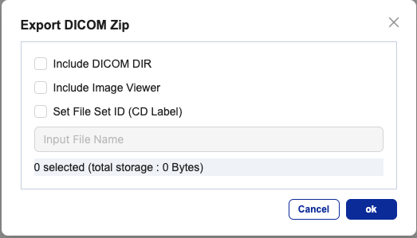

# DICOM Export

1. Check the box for the study you wish to download.
    * Limit: Up to 5 studies if images from multiple patients are selected.
2. Click the button in the upper right corner or right-click to open the submenu.
3. Choose one of the following download formats:
    * Export DICOM Zip: Export as a compressed file.
    * Export DICOM CD: Export as a CD file (ISO format).
    * Export DICOM As: Export with a specified file extension and name format.

## Export Selected View

You can export a selected view to the clipboard or as an image file (PNG, TIF, JPG, JPEG2000) via the toolbar icon or by navigating to File > Export > Export View in the main menu.
* Current View: Exports the view as displayed with overlay details.
* Anonymize: Removes identifying information from overlays.
* Original Image: Adjusts the view to match the original image with certain options.

## Upload in Append to Series Mode

Select one study in the Studies area, then click the list mode button in the Series area.
Choose one or multiple series in the Series area, then click the A_Capture button in the upper right.
For mobile upload:
* Scan the QR code in the Advanced Capture popup.
* Tap the Capture icon, select the file (photo or video) from the file explorer, and tap Done.
* Tap Upload and, if successful, click OK in the Upload Complete popup.
* If upload fails, reorganize the files, then tap X or Re-upload.
* Click Close in the Advanced Capture popup, then confirm with OK.

## Upload from PC Register Patient Tab

Click the A_Capture button in the upper right.
In the Register Patient tab, enter the patient ID or click Generate ID.
In the left area, click the Capture icon.
Select the file (JPEG, JPG, PNG, MP4, MOV) from the file explorer, then click Done.
Tap Upload and, if successful, select one of the following options in the Upload Completed popup:
* Keep Uploading: Continue uploading additional files.
* Start Over: Restart the process.
* Close: Finish and close.
If upload fails, reorganize the files and tap X or Re-upload.

