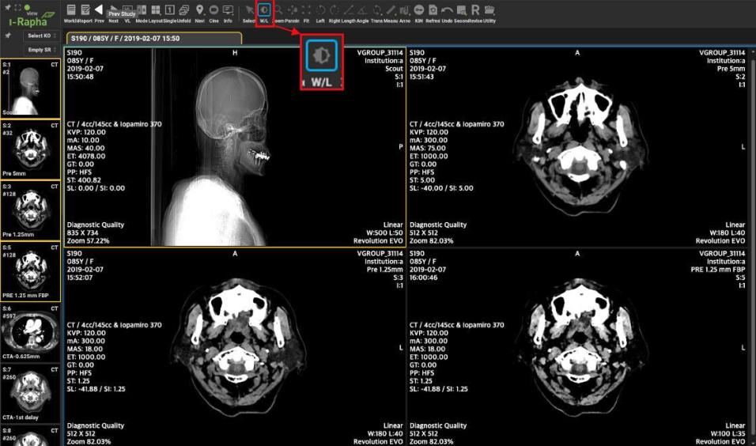
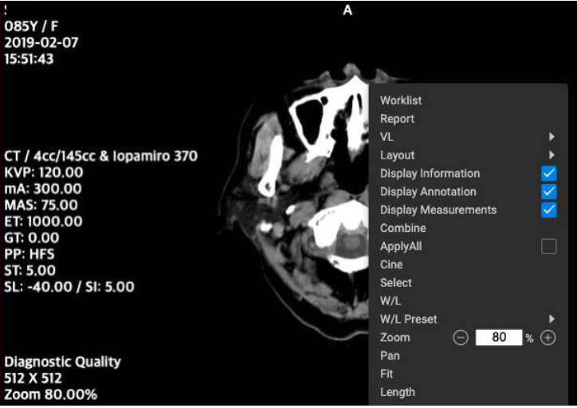
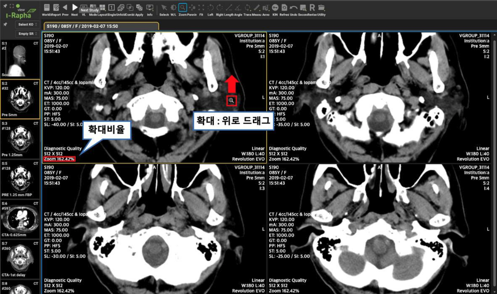
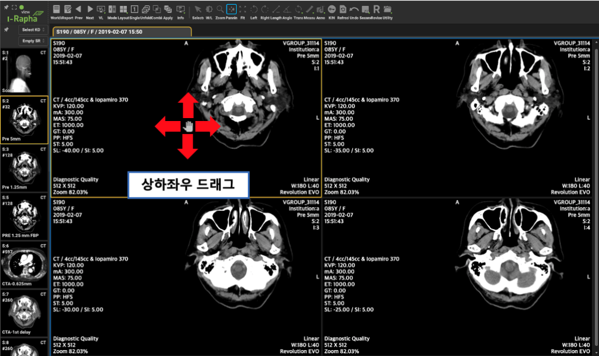
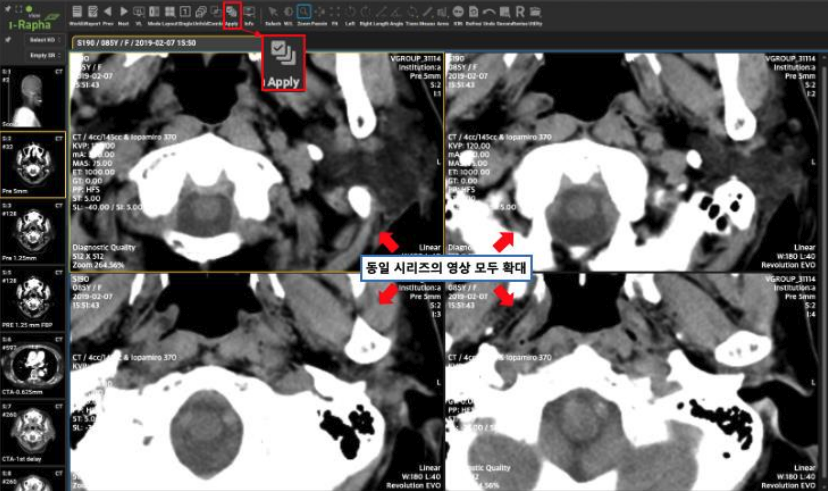
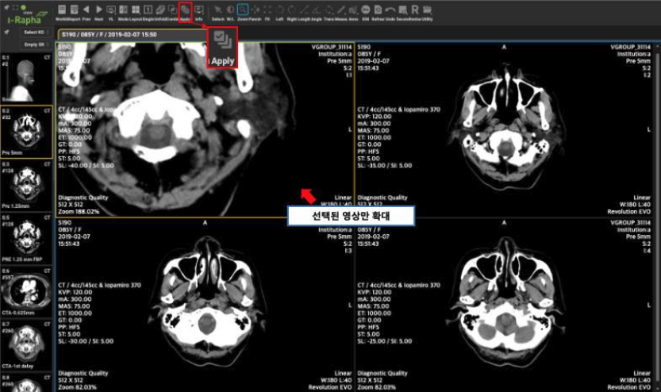
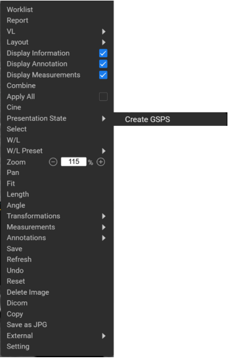

# Image Orientation and Manipulation

## Medical Image Manipulation

I-Rapha View™ offers various image manipulation and measurement features, including zoom, brightness, contrast adjustments, and measurement of specific regions for length or angle.

## Adjusting Window/Level (Brightness & Contrast)

**Window W/L (Brightness & Contrast) Adjustment**

* Window Width controls contrast, and Window Level controls brightness.
* To adjust, place the mouse cursor over the image, right-click, and drag vertically or horizontally.
    * Horizontal drag adjusts Window Width (contrast).
    * Vertical drag adjusts Window Level (brightness).

Increasing the Window Width allows a broader brightness range but reduces contrast. Decreasing it narrows the brightness range, resulting in higher contrast.

## Zooming, Panning

### Zoom

This function allows you to zoom in or out on the displayed image. Right-click the selected image to open a context menu, then click the zoom out ( - ) or zoom in ( + ) icon to adjust the image size incrementally. The adjustable range is from 25% to 500%:

For finer adjustments, input the desired percentage directly into the text field and press Enter. This allows a custom zoom level within the 25-500% range.

To zoom in, select the Zoom tool and drag the mouse upward over the image.

To zoom out, select the image and drag the mouse downward.

:::info
Zooming always centers on the middle of the screen, enhancing positional accuracy. Since the default view mode is set to "Fit to Best Size," images remain centered while scrolling. To offset the image from the center during scrolling, change the view mode or zoom level.
:::

### Pan
Use this tool to move the position of the displayed image within the viewer window.

### Rotate

**Rotate Left: Rotate Image to the Left**
1. From the menu bar, select Rotate Left under the [Trans].
2. The entire series of the selected image rotates left (counterclockwise). In Image Mode, this applies to the visible image series in the viewer window; in Stack Mode, it applies to the selected image series. Rotate Left can also be accessed via the Left tooltip in the menu bar.

**Rotate Right: 영상 오른쪽으로 돌리기**
메뉴바에서 [Trans.] 메뉴의 하위메뉴에서 [Rotate Right] 메뉴를 마우스로 선택합니다.
Rotate Right 는 메뉴바의 Right 툴팁으로도 적용가능합니다.

## Fit

영상이 Zoom 기능으로 확대·축소되거나 Pan 기능으로 이동표시되어 있을 때 영상표시칸에 영상이 처음 표시된 상태로 조정하여 되돌리는 기능입니다. 

## Apply All(시리즈 내 모든 영상 적용)

이미지 모드(Image Mode)에서만 나타나는 메뉴로 현재 영상에 이루어지는 작업이 시리즈 내의 모든 영상에 적용되는지를 설정합니다.
선택상태일 경우 시리즈 내의 모든 영상에 작업의 결과가 반영됩니다. 미선택 상태일 경우 작업이 이루어지는 영상에만 작업결과가 반영됩니다.

이미지모드(Image Mode)가 선택되었을 때 나타나는 메뉴이며 [Apply All] 상태가 ON일 경우 시리즈 내의 모든 영상에 영상 조작 기능(Zoom, Window Width/Level 조정 등)을 동시에 적용됩니다. OFF 상태일 경우에는 선택된 영상에만 영상 조작 기능이 적용되며, 시리즈 내의 다른 영상에는 영향을 미치지 않습니다. 만일 동일한 영상 조작 기능을 시리즈 내의 다른 영상에 적용하기 위해서는 동일한 작업을 반복해야 합니다.

토글 방식으로 작동하며, [Combine] 메뉴를 클릭하면 현재 적용된 상태에서 다른 상태로 변경이 됩니다. 기본 상태는 ON 입니다.

Apply All 메뉴가 적용되는 영상 조작 기능은 다음과 같습니다.

* W/L
* Zoom
* Pan
* Fit 
* Trans > Reverse / Flip / Rotate Left / Rotate Right / Invert / Sharpening / Smoothing
* Pseudo Color
* Reset
* Undo

[Apply All] 메뉴가 ON 상태에서 Zoom 기능으로 하나의 영상을 확대할 경우 동일 시리즈 내의 모든 영상이 함께 확대됩니다.

 
[Apply All] 메뉴가 OFF 상태에서 Zoom 기능으로 하나의 영상을 확대한 경우 선택된 영상만 함께 확대됩니다.

## Transformations

Transformations(변형도구) 기능은 영상의 표시 방향이나 방법을 변경하여 영상조회를 더욱 효과적으로 영상조회를 할 수 있는 도구들을 제공합니다.

**Transformations 하위메뉴**

메뉴바에서 [Trans.] 메뉴를 마우스로 클릭합니다.

### Reverse: 영상 좌우 뒤집기
1. 메뉴바에서 [Trans.] 메뉴의 하위메뉴에서 [Reverse] 메뉴를 마우스로 선택합니다.

2. 선택된 영상이 속한 시리즈의 모든 영상들이 좌우가 뒤집어져서 표시가 됩니다. 이미지모드(Image Mode)에서는 [영상표시창]에 보이는 영상의 시리즈에 적용됩니다. 스택모드(Stack Mode)에서는 선택한 영상의 시리즈에 적용됩니다.

### Flip: 영상상하 뒤집기
1. 메뉴바에서 [Trans.] 메뉴의 하위메뉴에서 [Flip] 메뉴를 마우스로 선택합니다.

2. 선택된 영상이 속한 시리즈의 모든 영상들이 상하가 뒤집어져서 표시가 됩니다. 이미지모드(Image Mode)에서는 [영상표시창]에 보이는 영상의 시리즈에 적용됩니다. 스택모드(Stack Mode)에서는 선택한 영상의 시리즈에 적용됩니다.

### Invert: 영상 명암 반전하기
1. 메뉴바에서 [Trans.] 메뉴의 하위메뉴에서 [Invert] 메뉴를 마우스로 선택합니다.
2. 선택된 영상이 속한 시리즈의 모든 영상들의 명암이 반전이 되어 표시됩니다.

### Sharpening: 영상 선명하게 보기
선택된 영상에 Sharpening 처리를 하여 더욱 선명하게 보이게 합니다.

1. 메뉴바에서 [Trans.] 메뉴의 하위메뉴에서 [Sharpening] 메뉴를 마우스로 선택합니다.
2. 선택된 영상이 속한 시리즈의 모든 영상들의 픽셀이 더욱 선명하게 표시가 됩니다. 이미지모드(Image Mode)에서는 [영상표시창]에 보이는 영상의 시리즈에 적용됩니다. 스택모드(Stack Mode)에서는 선택한 영상의 시리즈에 적용됩니다

###  Smoothing: 영상 부드럽게 보기
선택된 영상에 Smoothing 처리를 하여 부드럽게 보이게 합니다.
1. 메뉴바에서 [Trans.] 메뉴의 하위메뉴에서 [Smoothing] 메뉴를 마우스로 선택합니다.

2. 선택된 영상이 속한 시리즈의 모든 영상들의 픽셀을 부드럽게 표시가 됩니다.
이미지모드(Image Mode)에서는 [영상표시창]에 보이는 영상의 시리즈에 적용됩니다.
스택모드(Stack Mode)에서는 선택한 영상의 시리즈에 적용됩니다.

### Pseudo Color: 영상 색상 맵핑하기
Pseudo Color 는 흑백 영상의 각 픽셀에 대해 그 농도 레벨에 따라 색을 할당하여 색채화하는 기법입니다.
1. 메뉴바에서 [Trans.] 메뉴의 하위메뉴에서 [Pseudo Color] 메뉴를 마우스로 선택합니다.
2. Pseudo Color 팝업창의 리스트박스에서 선택한 Pseudo Color 방식에 따라 색상이 입혀져서 표시됩니다. 이미지모드(Image Mode)에서는 [영상표시창]에 보이는 영상의 시리즈에 적용됩니다. 스택모드(Stack Mode)에서는 선택한 영상의 시리즈에 적용됩니다.

## Refresh

영상이 뷰어에 로딩된 이후에 새로 추가된 영상을 보기 위해서 영상을 뷰어에서 다시 로딩합니다.

## Undo(실행취소)

영상에 마지막으로 삽입된 주석(Annotation)이나 측정(Measurement)을 취소하는 메뉴입니다.

## Left / Right (영상 회전)

메뉴바의 [Left]기능은 Transformations 메뉴에서 설명할 [Rotate Left]와 같은 기능을 수행합니다.
메뉴바의 [Right]기능은 Transformations 메뉴에서 설명할 [Rotate Right]와 같은 기능을 수행합니다.

## Display Information/Display Annotation/Display Measurent

[영상표시창]의 영상 위에 표시되는 정보, 주석, 측정정보의 표시여부를 설정하는 토글기능입니다.

## Presentation State

Presentation State 를 선택하여 영상에 적용하는 기능입니다. 저장된 Presentation State 가 없는 경우 목록에 Create GSPS 만 나타납니다. 저장된 목록이 있는 경우 목록에서 적용할 state 를 클릭하면 해당 state 에 체크 표시가 되고 선택한 state 가 적용된 상태로 영상이 업데이트 됩니다. 원본 영상으로 되돌리고 싶다면 목록에서 체크된 state 를 다시 클릭합니다. 체크가 해제되면서 영상은 원본 영상으로 업데이트 됩니다.

