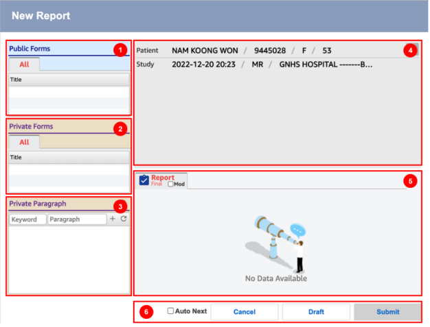
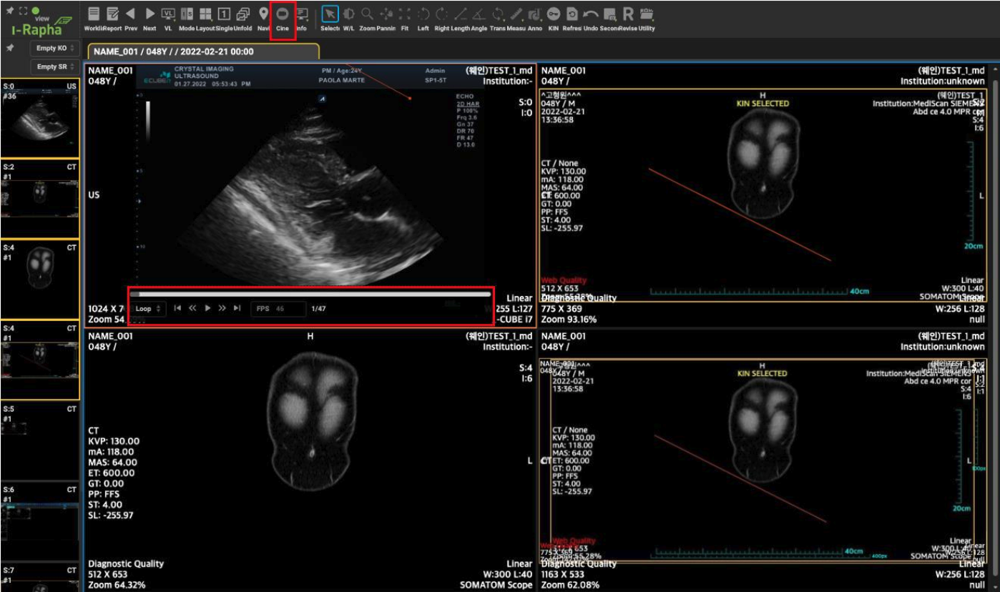
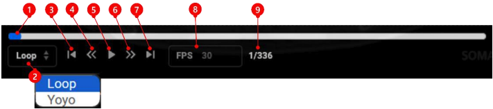

# Viewer’s tools

## Medical Image Information Display

You can display or hide patient information, image information, annotation information, and measurement information over the image in the display window.

1. Patient Name: Patient's name
2. Patient ID: Patient number
3. Age / Sex: Patient's age / gender
4. Content Date: Date of the image (capture date)
5. Content Time: Time of the image (capture time)
6. Modality: Equipment-related information
7. Image Quality: Image quality
8. Width X Height: Image size (width x height in pixels)
9. Zoom: Image zoom ratio
10. Institution: Hospital name
11. Series Description: Series description
12. Series Number: Series number
13. Instance Number: Image number (current index / total index)
14. VOI LUT Type: Image type
15. Window Width/Level: Window level
16. Modality Manufacturer: Equipment manufacturer

To display patient information, study information, and image information over the image in the display window, select the [Information] submenu under the [Info] menu in the menu bar.

1. Click the [Info] menu in the menu bar.

2. In the [Info] submenu, select the items you wish to display or hide over the image.

1. Selecting Show All displays all Information, Annotation, and Measurements.
2. Selecting Hide All hides all Information, Annotation, and Measurements.
3. Selecting Information displays medical image information over the image. Deselecting it will hide the medical image information.
4. Selecting Annotation displays annotation information over the image. Deselecting it will hide the annotation information.
5. Selecting Measurements displays measurement information over the image. Deselecting it will hide the measurement information.
6. Selecting Overlay displays overlay layers for images that have them. Deselecting it will hide the overlay layers for such images.

## Report
조회하고 있는 스터디에 대한 판독소견서를 작성하고 조회하는 기능을 제공하는 메뉴입니다.

1. Public Form: Public report template
2. Private Form: Report template pre-created by the interpreter
3. Private Paragraph: Insert phrases previously saved in the report statement.
4. Interpretation Input: Create a new interpretation report for the selected study.
5. Interpretation History: Displays a list of interpretation reports created for the selected study, sorted by interpretation date and time.
6. Function Buttons:
    * Auto Next: Automatically loads the next study
    * Cancel: Cancel the interpretation input
    * Draft: Save as a draft
    * Submit: Save the report

### Cine(Video)

This feature is used to display images from a series with multiple frames like a video. If the selected series contains multiple frames, the Cine function will be displayed automatically and can be toggled on or off using the menu.

**Cine Mode**

This menu is used to view the selected series of images in Stack Mode. The [Cine] menu operates in a toggle manner, with the OFF state as the default.

1. In Stack Mode, click the [Cine] menu on the menu bar.
2. A playback control box will appear over the images of each series.
3. You can view the images like a video using the playback control box. The components of the playback control box are as follows:

1. Playback Bar: Indicates the current position of the playing image. Hovering over the playback bar will show a thumbnail of the image at that position, and clicking it will display the image in the viewing area.
2. Repeat Playback Mode: Select the mode for repeating playback.
    * Loop: The images will play in order from the first image when repeated.
    * YoYo: The playback will reverse from the last image back to the first when it reaches the end.
3. Jump to First Image: Moves to the first image in the series and displays it in the viewing area.
4. Previous Image: Moves to the image one frame before the currently displayed image.
5. Play/Pause: Plays or pauses the video.
    * Play: Plays the video.
    * Pause: Pauses the currently playing video.
6. Next Image: Moves to the image one frame after the currently displayed image.
7. Jump to Last Image: Moves to the last image in the series and displays it in the viewing area.
8. Playback Speed: Adjusts the playback speed by specifying FPS (frames per second) (1-33 FPS).
9. Image Number: Displays the current image number relative to the total number of images in the series.
