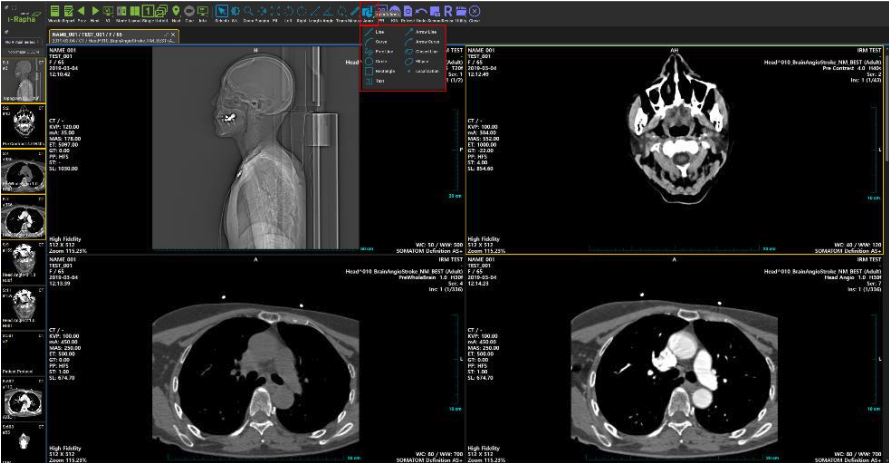

# Annotation and Measurement

## Annotation 
The [Annot.] menu on the menu bar contains functions for inputting annotations on images. Selecting the [Annot.] menu will display a submenu. The submenu consists of the following options:

* Line: Inserts a straight line annotation on the image.
* Arrow Line: Inserts an arrow annotation on the image.
* Curve: Inserts a curved annotation on the image.
* Arrow Curve: Inserts a curved arrow annotation on the image.
* Free Line: Inserts a freehand line annotation on the image.
* Closed Line: Inserts a closed curve annotation on the image.
* Circle: Inserts a circle annotation on the image.
* Ellipse: Draws an ellipse annotation on the image.
* Rectangle: Inserts a rectangular annotation on the image.
* Magnify: Enlarges and displays a portion of the image.
* Localization: Inserts a localization point on the image.
* Text: Inserts text annotations on the image.
* 3 Points Angle: Displays the angle formed by three specified points.
* Cobb’s Angle: Measures the Cobb angle, used to assess spinal curvature.
* Pixel Value: Displays the position and color values (e.g., Hounsfield values for CT) of a specified pixel in 2D or 3D coordinates.
* Pixel HU Value: Saves the pixel value at the clicked location.
* CT Ratio: Measures the Cardiothoracic Ratio (CT Ratio).
* Calibrate: Recalculates total measurements by redefining unit lengths if pixel length information (mm) is absent or inaccurate.

## Undo
The [Undo] menu on the menu bar allows you to cancel the last inserted annotation or measurement on the image.

### Line
The Line function in the [Annot.] menu draws a straight line annotation on the image.
1. Select the [Line] submenu from the [Annot.] menu in the menu bar. The mouse cursor will change, enabling the Line annotation feature.
2. To draw a line annotation, click to specify the starting point on the image, then drag to the desired location and release the mouse button to draw the line.
3. Pressing the ESC key while in the line annotation state will complete the annotation and change to select mode.
4. Annotations are automatically saved upon completion.
For modifying, moving, or deleting annotations, please refer to the content on the "Length Measurement" feature.

### Arrow Line
The [Arrow Line] function in the [Annot.] menu allows you to freely draw arrow annotations on the image using the mouse.
1. Select the [Arrow Line] submenu from the [Annot.] menu in the menu bar. The mouse cursor will change, enabling the Arrow Line annotation feature.
2. To draw an arrow line annotation, click to specify the starting point on the image, then drag to the desired location and release the mouse button to draw the arrow line. The release point becomes the arrowhead.
3. Pressing the ESC key while in the arrow line annotation state will complete the annotation and change to select mode.
4. Annotations are automatically saved upon completion. Refer to the "Length Measurement" feature in this section for modifying, moving, or deleting annotations.

### Curve

The [Curve] function in the [Annot.] menu allows you to freely draw curved annotations on the image using the mouse.
1. Select the [Curve] submenu from the [Annot.] menu in the menu bar. The mouse cursor will change, enabling the Curve annotation feature.
2. Click to specify the starting point on the image, then drag to the desired location and release the mouse button to draw a straight line.
3. Drag the mouse at the endpoint of the straight line to bend it into a curve.
4. Pressing the ESC key while in the curve annotation state will complete the annotation and change to select mode.
5. Annotations are automatically saved upon completion. Refer to the "Length Measurement" feature in this section for modifying, moving, or deleting annotations.

### Arrow Curve: Curved Arrow Annotation
The [Arrow Curve] function in the [Annot.] menu allows you to freely draw curved arrow annotations on the image using the mouse.
1. Select the [Arrow Curve] submenu from the [Annot.] menu in the menu bar. The mouse cursor will change, enabling the Arrow Curve annotation feature.
2. Click to specify the starting point on the image, then drag to the desired location and release the mouse button to draw a straight arrow.
3. Drag the mouse at the endpoint of the straight line to bend it into a curve, with the release point becoming the arrowhead.
4. Pressing the ESC key while in the arrow curve annotation state will complete the annotation and change to select mode.
5. Annotations are automatically saved upon completion. Refer to the "Length Measurement" feature in this section for modifying, moving, or deleting annotations.

## Measurements

This section gathers functions related to image measurement.
The submenu that appears upon selection consists of the following options:
* Poly Line: Measures length using a polyline (broken line). The total length of the polyline is displayed.
* Polygon: Measures the perimeter length of a polygon formed by straight lines, as well as the minimum/maximum pixel values inside the area, pixel average value, and standard deviation of pixel values.
* Free Line: Measures the total length using a free line (curved line).
* Closed Line: Measures the perimeter length of a closed curve area, as well as the minimum/maximum pixel values inside the area, pixel average value, and standard deviation of pixel values.
* Curve Line: Creates a symmetric curve by bending a straight line and measures the total length of the curve.
* Center Line: Measures the lengths of two straight lines and the angle formed by the connection of their midpoints, allowing measurement of thickness and angles of skeletal regions.
* Circle (M): Measures area using a circle. The internal area of the circle is displayed.
* Ellipse (M): Measures and displays the internal area of an ellipse.
* Rectangle (M): Measures area using a rectangle. The internal area of the rectangle is displayed.
* Magnifier: Enlarges and displays a portion of the image.
* 3 Points Angle: Displays the angle formed by three specified points.
* Cobb’s Angle: Measures the Cobb angle, used for assessing spinal curvature.
* Pixel Value: Displays the position and color values (e.g., Hounsfield values for CT) of a specified pixel in 2D or 3D coordinates.
* Pixel HU Value: Saves the pixel value at the clicked location.
* CT Ratio: Measures the Cardiothoracic Ratio (CT Ratio).
* Calibrate: Recalculates total measurements by redefining unit lengths if pixel length information (mm) is absent or inaccurate.

### Length

When you select a starting and ending point on the desired area of the image with the mouse, a measurement line connecting these points will be displayed, and this feature measures the length of the straight line.

**Measuring Straight Length**

1. Select the [Length] menu from the menu bar with the mouse.
2. The mouse cursor will change to a measuring cursor, enabling the Length feature.
3. Click on the area you wish to measure to specify the starting point, then drag the mouse to the endpoint and release it.
4. A straight line connecting the starting and ending points will be displayed, along with the measured length of the line.
5. The measured data will be automatically saved upon completion of each measurement.

**Moving the Length Measurement Line**
To move the measurement line from the Length feature, follow these steps. This procedure applies not only to the Length feature but also to other Measurement and Annotation features.
1. Move the mouse cursor to the Length measurement line in selector mode and click it; the measurement line will be selected and change to yellow.
2. While the measurement line is selected, click and drag the mouse to move it to the desired location. The measurement value will be displayed at the moved location.
3. The modified data will be automatically saved upon completion of the modification.

**Modifying the Length Measurement Line**
To modify the measurement line from the Length feature, follow these steps. This procedure applies not only to the Length feature but also to other Measurement and Annotation features.
1. Click the endpoint of the measurement line with the mouse; the mouse cursor will change to a moving cursor.
2. In moving cursor mode, click on the measurement point to move it. The measurement line will be adjusted according to the moved point, and a new measurement value will be displayed.
3. The modified data will be automatically saved upon completion of the modification. You can also modify the measurement line using the Modify feature in the Length popup menu.

**Deleting Length Measurement Values**
To delete measurement values from the Length feature, follow these steps. This procedure applies not only to the Length feature but also to other Measurement and Annotation features.
1. Click on the measurement line with the mouse cursor; the line will be selected and change to yellow.
2. While the measurement line is selected, right-click with the mouse to display a popup menu. Select the Delete option from the popup menu.
3. The selected measurement line and its length measurement value will be deleted. You can also delete the measurement line by pressing the backspace key after selecting it.
4. Deleted data will be automatically saved.

**Pausing Length Measurement**

To stop the Length measurement feature, press the ESC key or follow the steps below.

### Angle Measurement

This feature displays two lines at a specific area and measures the angle formed between them. The measured angle is displayed in the format `@Interior Angle (Exterior Angle)`.

**Measuring Angles**

1. Select the [Angle] menu from the menu bar with the mouse.
2. The mouse cursor will change to a measuring cursor, enabling the Angle feature.
3. Click on the desired area to specify the starting point, then drag the mouse to the endpoint to designate the first measurement line.
4. Designate the second measurement line in the same manner; the angle formed with the first measurement line will be automatically displayed. The measured angle will be shown in the format `@Interior Angle (Exterior Angle)`.
5. The measured data will be automatically saved upon completion of the measurement.

**Center Line**

1. Draw a straight line to measure the width of a specific area, such as the skeleton.
2. Draw another straight line to measure the width of a different area.
3. Measure the lengths of both lines, along with the distance and angle between their center points.

**Cobb’s Angle**

1. Click points 1 and 2 to find the uppermost tilted vertebra and draw a parallel line.
2. Click points 3 and 4 to find the lowermost tilted vertebra and draw a parallel line.
3. Determine the presence of scoliosis.

**CT Ratio(Cardiothoracic Ratio)**

1. Click points 1 and 2 to draw a reference axis parallel to the spine.
2. Click points 3 and 4 to draw a line connecting the endpoints of the left atrium and right atrium.
3. Click points 5 and 6 to draw a line connecting the endpoints of the lungs (thoracic).
4. Confirm the results of the cardiothoracic ratio.

#### Poly Line: Measuring Length with Poly Line
The Poly Line feature in the [Measurements] menu allows length measurement using a polyline (a connected series of lines).
1. Select the [Poly Line] menu from the [Measurements] submenu in the menu bar.
2. The mouse cursor will change to a measuring cursor, enabling the Poly Line measurement feature.
3. Click on the desired area to specify the starting point of the measurement. You can then click anywhere to specify multiple measurement points, which will be connected by straight lines.
4. Each measurement point will be connected by straight lines, and the total length measured from the starting point will be displayed at each point.
5. Double-click the mouse or press the ESC key to complete the measurement, changing the state to Select.
6. The measured data will be automatically saved upon completion.
For modifying, moving, or deleting a Poly Line, refer to the section on 『Length Measurement』 in this chapter.

#### Polygon (M): Measuring Polygonal Areas
The Polygon feature in the [Measurements] menu allows you to draw a polygon with the mouse and measure the perimeter length, minimum/maximum pixel values, average pixel value, and standard deviation of pixel values within the area.
1. Select the [Polygon] menu from the [Measurements] submenu in the menu bar.
2. The mouse cursor will change to a measuring cursor, enabling the Polygon measurement feature.
3. Click and move the mouse to draw the polygonal area.
4. Starting from the third click, a line will be displayed connecting back to the first click point, allowing you to confirm the drawn area. To finalize the area, double-click to end the drawing.
5. The measurement values for the area will be displayed at the first click point.

#### Free Line (M): 자유선으로 길이 측정
The Free Line feature in the [Measurements] menu allows you to freely draw a measurement line with the mouse and measure its length.
1. Select the [Free Line] menu from the [Measurements] submenu in the menu bar.
2. The mouse cursor will change to a measuring cursor, enabling the Free Line measurement feature.
3. Click and move the mouse to draw the measurement line in the desired area.
4. The length of the measurement line will be displayed at the last measurement point.
5. Press the ESC key to complete the measurement, changing the state to Select.
6. The measured data will be automatically saved upon completion.
For modifying, moving, or deleting a Free Line, refer to the section on 'Length Measurement' in this chapter.

### Closed Line (M): 폐곡선 영역 측정
The Closed Line (M) feature in the [Measurements] menu allows you to draw a closed curve with the mouse and measure the perimeter length, minimum/maximum pixel values, average pixel value, and standard deviation of pixel values within the area.
1. Select the [Closed Line (M)] menu from the [Measurements] submenu in the menu bar.
2. The mouse cursor will change to a measuring cursor, enabling the Closed Line (M) measurement feature.
3. Click and drag the mouse to draw the desired area.
4. To finalize the area, release the mouse click. A line will automatically connect the release point to the first click point, completing the area.
5. The measurement values for the area will be displayed at the first click point.

#### Center Line: Measuring Distance and Angles Between Center Points of Lines
The Center Line feature in the [Measurements] menu allows you to measure the lengths of two lines and the angle formed by connecting their center points.
1. Click on the [Rectangle] menu from the [Measurements] submenu in the menu bar.
2. The mouse cursor will change to a measuring cursor, enabling the Center Line measurement feature.
3. Use the mouse to draw two measurement lines in the desired area. The measurement length will be displayed each time you draw a line.
4. When the second measurement line is drawn, a straight line connecting the centers of both lines will be created, and the measured distance and angle will be displayed automatically. The measured angle will be shown in the format @Interior Angle (Exterior Angle).
5. Press the ESC key to complete the measurement, changing the state to Select.
6. The measured data will be automatically saved upon completion.
For modifying, moving, or deleting Center Line measurements, refer to the section on 'Length Measurement' in this chapter.

#### Curve Line: Measuring the Length of a Curve
The Curve Line feature allows you to draw a curve with the mouse and measure its length.
1. Select the [Curve Line] menu from the [Measurements] submenu in the menu bar.
2. The mouse cursor will change to a measuring cursor, enabling the Curve Line measurement feature.
3. Use the mouse to draw a straight line in the desired area.
4. Drag the mouse at points where the line will curve to create a curve.
5. The calculated length of the curve will be displayed.
6. Press the ESC key to complete the measurement, changing the state to Select.
7. The measured data will be automatically saved upon completion. For modifying, moving, or deleting Curve Line measurements, refer to the section on 'Length Measurement' in this chapter.

#### Circle (M): Measuring the Area of a Circle
The Circle (M) feature allows you to measure the area of a circle drawn with the mouse.
1. Select the [Circle (M)] menu from the [Measurements] submenu in the menu bar.
2. The mouse cursor will change to a measuring cursor, enabling the Circle (M) measurement feature.
3. Use the mouse to draw a circle in the desired area.
4. The calculated area, minimum/maximum pixel values, average pixel value, and standard deviation of pixel values within the area will be displayed.
5. Press the ESC key to complete the measurement, changing the state to Select.
For modifying, moving, or deleting Circle area measurements, refer to the section on 'Length Measurement' in this chapter.

#### Ellipse (M): Measurement of Elliptical Area

The Ellipse (M) function measures the area of an ellipse drawn using the mouse.

Click on the [Ellipse (M)] menu from the [Measurements] submenu in the menu bar.
The mouse cursor changes to a measurement cursor, enabling the Ellipse measurement function.
Use the mouse to draw an ellipse in the desired area.
Drag the control points of the ellipse to change its size.
The calculated area of the ellipse is displayed.
The measurement data is automatically saved upon completion.

#### Rectangle (M): Measurement of Rectangular Area

The Rectangle (M) function measures the perimeter length of a rectangle drawn with the mouse, along with the minimum/maximum pixel values, average pixel value, and standard deviation of pixel values within the area.
1. Select the [Rectangle (M)] menu from the [Measurements] submenu in the menu bar.
2. The mouse cursor changes to a measurement cursor, enabling the Rectangle measurement function.
3. Use the mouse to draw a rectangle in the desired area.
4. The perimeter length, area of the rectangle, minimum/maximum pixel values, average pixel value, and standard deviation of pixel values are displayed.
5. Pressing the ESC key while in Rectangle area measurement mode changes the state to Select.
6. The measurement data is automatically saved upon completion.
For modification, movement, or deletion of Rectangle area measurements, refer to the section on 'Length (Straight Length Measurement)' in this chapter.

#### 3 Points Angle: 각도측정(3 점 방식)
The 3 Points Angle function in the [Measurements] menu allows you to measure an angle by specifying three points.
1. Select the [3 Points Angle] menu from the [Measurements] submenu in the menu bar.
2. The mouse cursor changes to a measurement cursor, enabling the 3 Points Angle measurement function.
3. Click to select three measurement points in the order shown in the next illustration.
4. The angle formed by the specified three measurement points is displayed next to the second measurement point, in the format @inner angle (outer angle).
5. Pressing the ESC key during 3 Points Angle measurement mode changes the state to Select.
6. The measurement data is automatically saved upon completion.
7. For modifications, movements, or deletions of Points Angle measurements, refer to the section on 'Length (Straight Length Measurement)' in this chapter.

### Cobb’s Angle: 콥스앵글 측정
The Cobb’s Angle function in the [Measurements] menu is commonly used to measure the degree of spinal curvature in cases of scoliosis from a plain X-ray image.
1. Select the [Cobb’s Angle] menu from the [Measurements] submenu in the menu bar.
2. The mouse cursor changes to a measurement cursor, enabling the Cobb’s Angle measurement function.
3. Place two measurement points to indicate the first measurement line in the desired area.
4. Displaying the second measurement line will show the angle formed with the first measurement line, displayed in the format `@inner angle (outer angle)`.
5. Pressing the ESC key during Cobb’s Angle measurement mode changes the state to Select.
6. The measurement data is automatically saved upon completion..

### CT Ratio: Measurement of Cardiothoracic Ratio
The CT Ratio function in the [Measurements] menu measures the cardiothoracic ratio (CT Ratio), which helps determine heart enlargement by comparing the width of the heart to that of the thorax.
1. Select the [CT Ratio] menu from the [Measurements] submenu in the menu bar.
2. The mouse cursor changes to a measurement cursor, enabling the CT Ratio measurement function.
3. Following the numbered order in the next illustration, draw a reference line (Line 1) along the spine, then draw lines to measure the heart's size (Lines 2 and 3) on both sides, and finally draw the thoracic size measurement line (Line 4).
4. The results display the size of the heart (C), the size of the thorax (T), and the cardiothoracic ratio (C/T). The unit for the CT ratio is expressed as a percentage (%).
5. Pressing the ESC key during CT Ratio measurement mode changes the state to Select.
6. The measurement data is automatically saved upon completion.

#### Pixel Value: Viewing Pixel Values
The Pixel Value function in the [Measurements] menu provides information about the location and intensity value (color value) of each pixel in the image. Specifically, the pixel values in CT images represent the CT value (Hounsfield Unit Value), which varies by tissue type. The CT values for various tissues are as follows:

| Tissue   |       CT Number(Hounsefield Unit Value)      |  
|----------|:--------------------------:|
| Air |  -1000 | 
| Lung |    -500   | 
| Fat | -100~-50 |
| Water |   0 | 
| Kidney |    30   | 
| Blood | 30~45 |
| Muscle |  10~40 | 
| Grey matter |    37~45   | 
| White matter | 20~30 |
| Liver |  40~60 | 
| Soft Tissue, Contrast |    100~300   | 
| Bone |  700(cancellous bone)~3000(dense bone)   | 

Select the [Pixel Value] menu from the [Measurements] submenu in the menu bar. Click on the desired location to measure pixel values, and the corresponding pixel information will appear at the bottom of the image. The displayed pixel information includes:

**Position: Pixel Location Information**
* 3D Position: For images with three-dimensional coordinates (e.g., CT, MR), the position information for the X, Y, and Z axes is displayed.
* 2D Position: For images with two-dimensional coordinates (e.g., CR, DX), the position information for the X and Y axes is displayed.
* Pixel Value: The intensity or color value of the pixel is highlighted, particularly the CT value (HU Value) for CT images.

#### Magnifier: Viewing with a Magnifying Glass
The Magnifier function in the [Measurements] menu allows for zooming in on a specific area without enlarging the entire image.
1. Select the [Magnifier] menu from the [Measurements] submenu in the menu bar.
2. The mouse cursor changes to a magnifying glass cursor, enabling the magnification function.
3. Click or drag the mouse over the desired area to enlarge it with the magnifying glass effect.
4. To complete the magnifier view, press the ESC key.

#### Calibrate: Correcting Pixel Length
The Calibrate function in the [Measurements] menu allows you to correct pixel length information (mm) if it is absent or inaccurate. By dragging the mouse over a reference length and releasing the click, a popup will appear to enter the length to calibrate. After entering the desired length and confirming, the length information on the ruler displayed on the right and bottom of the image will be updated. If measurements were previously taken, they will be recalculated based on the calibrated length and updated on the screen. Note that the values stored in the image are not changed, and any updates will only be reflected on-screen.

## Reset

The Reset function restores all operations applied to the image (W/L, Zoom, Pan) or measurement functions (Length, Angle, Trans, Measurements, Annot.) to their initial state.

**Reset: Restoring Image to Original State**
1. Click on the [Reset] menu from the [Utility] submenu with the image where operation or measurement functions have been applied.
2. All actions performed on the image will be reset, restoring it to its original state. The mouse cursor will revert to the default Selector state.

