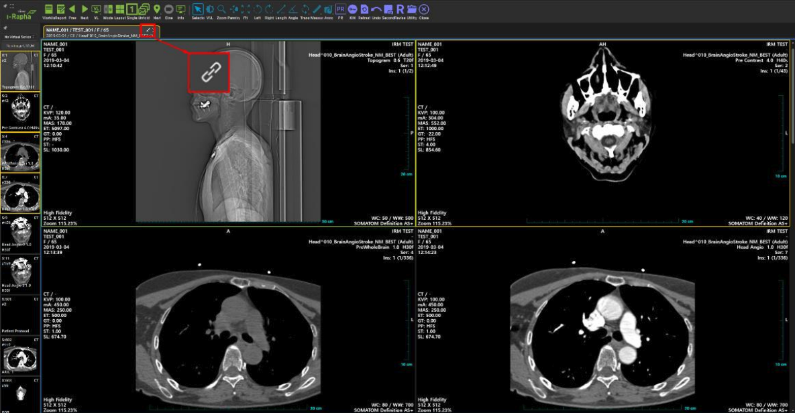
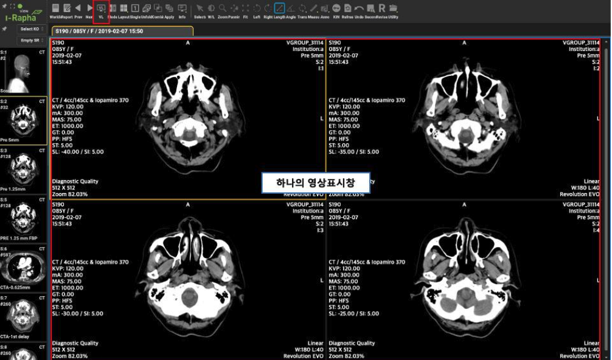
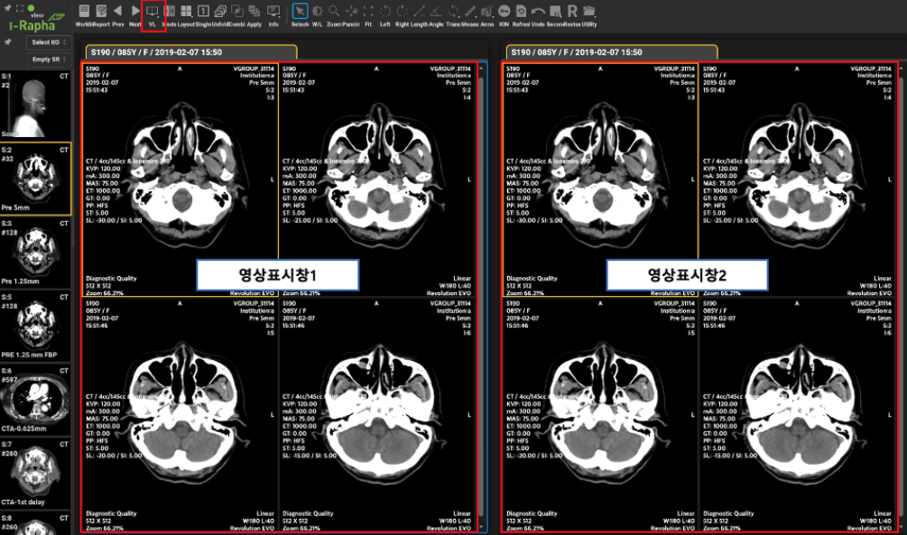
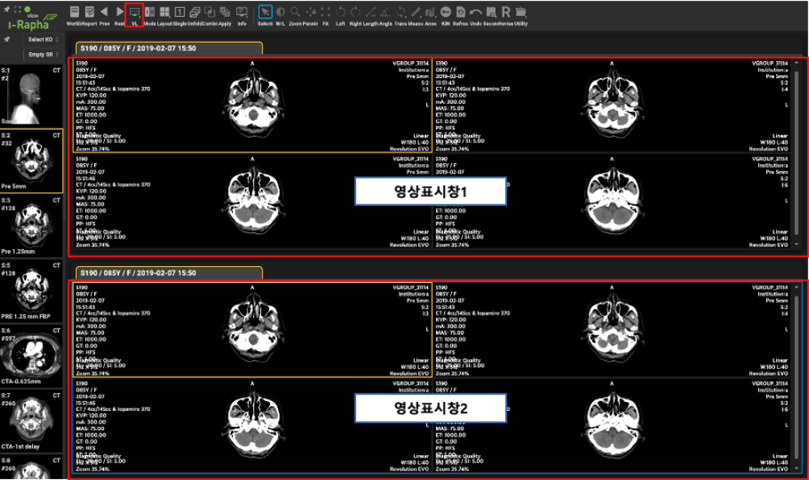

# Comparing Studies

The current viewer displays information about the loaded studies, with one study tab created for each study. The study tab for the currently displayed study has a turquoise background, while study tabs for studies that are loaded but not displayed appear in gray.

**Study Tab Display Information**

* Patient Name: The name of the patient
* Exam Date: The date of the exam
* Sex: Gender (M: Male, F: Female, O: Other)
* Age: Age (Y: Years, M: Months, D: Days)

## Searching for Related Studies Using Study Tabs

When the mouse cursor hovers over a study tab, a Related Study icon appears in the upper right corner. Clicking this icon displays a list of other studies taken with the same patient ID as the study shown in the [Image Display Window].

## Study Comparison in Virtual Layout

**Virtual Layout of the Image Display Window**

Changing the virtual layout using the [VL] menu on the menu bar will also alter the arrangement of the [Image Display Window].

Vertical Layout: Two image display windows run side by side, allowing you to compare different studies within a single viewer.

Horizontal Layout: Two image display windows run one above the other, enabling the comparison of different studies within a single viewer.

